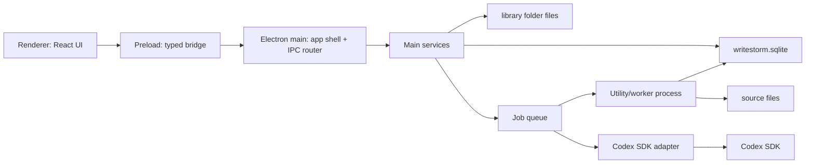

# WriteStorm Technical Design

日期：2026-07-05  
状态：活跃 V1 技术方案；实现 schema 已同步至 migration 007
范围：拆解工作台优先路线的工程技术方案，不包含 UI 高保真、不包含真实 AI 拆解实现、不包含原创小说项目。

## 1. Summary

WriteStorm V1 采用 Electron + React + TypeScript 构建 Windows 11 和 macOS 双桌面端，不提供 Web 运行版。应用以 SQLite 作为唯一事务性主事实源，JSON/Markdown 只作为导出、镜像或人类可读产物。AI V1 只允许接入 Codex SDK；如果 Codex SDK spike 不能满足结构化输出、取消、日志、鉴权和打包运行要求，V1 AI 能力阻塞，不回退到 `codex exec`、app-server、GUI app 自动化或其他供应商。

Task 20 recertifies the foundation around schema epoch 2 and migrations 001/002. The implemented registry now continues through migrations 003–007 for analysis-module definitions/instances/placeholders and TypeLibrary reference/Book-binding facts. Library open is `readonly probe -> readonly backup when migration is pending -> writable open -> migrate -> resulting-schema validation -> publish session`. Repositories and services receive session-bound Units of Work rather than a public SQLite handle. Imported bytes live at `source/{sourceTextId}/{originalFileName}`. Jobs are created queued, transition through policy, and complete with their final checkpoint in one transaction. Renderer server state uses session-scoped TanStack Query keys.

Block 12 freezes seven MainType and seven orthogonal ContentFocus options, user-only Book binding, CAS, active-only selectors and Book-pinned historical display metadata. Technique production tables remain unadmitted: there is no candidate producer, atomic adoption transaction, `TechniqueEntry` persistence, repository/service, or mutation IPC in the implemented schema.

首个实现增量仍是 `docs/tasks/TASK-001-breakdown-workbench-foundation.md`：资料库、拆解书架、导入、结构校正、模块实例骨架、job 状态和导出阻塞态。

## 2. Source Basis

- Product contract: `docs/product/write-storm-product-design.md`
- Flow contract: `docs/product/FLOWS.md`
- Gate task: `docs/tasks/TASK-000-pre-v1-hard-gates.md`
- First increment task: `docs/tasks/TASK-001-breakdown-workbench-foundation.md`
- Electron process/security docs: https://www.electronjs.org/docs/latest/tutorial/process-model and https://www.electronjs.org/docs/latest/tutorial/security
- Electron IPC docs: https://www.electronjs.org/docs/latest/tutorial/ipc
- Electron Forge Vite docs: https://www.electronforge.io/config/plugins/vite
- SQLite app-file format docs: https://www.sqlite.org/appfileformat.html
- Codex official manual: local current cache generated by `openai-docs` helper; relevant sections are Codex SDK, app-server and non-interactive mode.

## 3. Stack Decisions

| Layer | Decision | Reason |
| --- | --- | --- |
| Desktop shell | Electron Forge + Vite | Cross-platform desktop packaging, Vite dev loop, Electron process model |
| UI | React + TypeScript | Mature component ecosystem and strict typed UI state |
| Language | TypeScript strict mode | Shared types across main/preload/renderer/services |
| Main store | SQLite | Transactional local app-file store, strong migration and recovery story |
| SQLite access | `better-sqlite3` in main/utility service | Simple transactions and deterministic local writes; keep heavy work off renderer |
| Renderer state | TanStack Query | UI treats main process services as the data source, not as local truth |
| Runtime validation | Zod | Validate IPC requests/responses and imported/exported structured payloads |
| Unit/integration tests | Vitest | TypeScript-friendly tests for shared, main and service code |
| Renderer tests | React Testing Library | Component tests for empty/error/recovery UI states |
| E2E tests | Playwright for Electron | Real desktop entry-path verification |
| IPC | Typed allowlisted channels | Renderer cannot access fs, SQLite, Codex SDK or shell APIs directly |
| AI | Codex SDK only in V1 | V1 admission decision; no fallback to exec/app-server/other providers |
| Package manager | npm | Keep initial scaffold ordinary and compatible with Electron Forge docs |

## 4. Process Architecture



### Long-term AI provider boundary

The long-term direction is `Job/Pipeline -> AiExecutionPort -> ProviderAdapter`. Each provider adapter owns its SDK types, authentication, event protocol, cwd/config requirements, cancellation semantics, error mapping and packaged runtime. Provider selection is explicit; provider failure never causes a silent switch to another adapter.

Codex is the first V1 adapter, but Codex SDK types, CLI/JSONL events, Git/cwd requirements and child-process semantics must not spread into `JobService`, SQLite public models, renderer, shared DTOs or analysis-module domain objects. Task 6A does not implement the production `AiExecutionPort`, and Task 6A does not implement formal provider registry, non-Codex adapters, dynamic provider loading or a real AI workflow. It creates a Codex-specific feasibility probe only.

### Main process

Owns:

- App lifecycle, windows, menus and native dialogs.
- Library folder selection and trusted path checks.
- SQLite connection, migrations and transactions.
- Service registration and typed IPC handlers.
- Job queue orchestration.
- Codex SDK adapter lifecycle after spike passes.

Does not own:

- React rendering.
- Direct rich-text editing.
- Large CPU-bound parsing on the UI path.

### Preload

Owns:

- `contextBridge` exposure of a narrow `window.writestorm` API.
- Request/response typing for IPC channels.
- No business logic beyond argument shape forwarding.

Rules:

- No raw `ipcRenderer` exposure.
- No fs, SQLite, shell or Codex SDK exposure to renderer.
- Every exposed method maps to a named main-process handler.

### Renderer

Owns:

- Book shelf UI.
- Import wizard UI.
- Structure review and freeze UI.
- Breakdown workbench UI.
- Job status and recovery UI.
- Export blocked/available UI.

Rules:

- Treats SQLite data as remote service data accessed through typed IPC.
- Holds only view state and cached query results.
- Cannot write files, open SQLite, spawn processes or call Codex.

### Utility/worker process

Owns work that may block:

- File hash and encoding detection.
- Large text scanning.
- Chapter/title candidate extraction.
- Future Codex SDK execution if spike proves this is the stable process boundary.

Rules:

- Reports progress through `JobService`.
- Uses checkpointed units.
- Can be cancelled by job id.

## 5. Source Tree Target

First implementation should create this shape:

```text
package.json
forge.config.ts
vite.main.config.ts
vite.preload.config.ts
vite.renderer.config.ts
tsconfig.json
src/
  main/
    main.ts
    windows/
    ipc/
    services/
    db/
    jobs/
    codex/
  preload/
    index.ts
  renderer/
    App.tsx
    routes/
    features/
    components/
    styles/
  shared/
    contracts/
    domain/
    errors/
    ids.ts
tests/
  unit/
  integration/
  e2e/
```

No implementation task may put privileged Node APIs under `src/renderer`.

## 6. Library Folder Contract

```text
library-root/
  manifest.json
  writestorm.sqlite
  source/
    breakdown-books/
      {book-id}/
        original.txt
  exports/
    {export-id}/
  logs/
  cache/
  mirrors/
    markdown/
    json/
```

Rules:

- `writestorm.sqlite` is the only main fact source, including authoritative schema version through SQLite `schema_migrations`.
- SQLite `schema_migrations` is the authoritative schema-version source.
- SQLite `library` row owns library identity once the database exists; `LibrarySummary` must read id, name and app version from SQLite, not manifest identity fields.
- `manifest.json` stores library identity, `manifestVersion`, app version, database filename, and optional `schemaVersionHint` diagnostic metadata. `schemaVersionHint` must never override SQLite `schema_migrations`.
- `source/` stores immutable imported source copies.
- `exports/` stores user-created export packages.
- `logs/` stores user-visible local logs under the configured log policy.
- `cache/` is rebuildable.
- `mirrors/` is derived from SQLite and can be rebuilt; it never overrides SQLite automatically.

## 7. SQLite Schema Contract

Admitted tables through migration 007:

| Table | Purpose |
| --- | --- |
| `schema_migrations` | Applied migrations and timestamps |
| `library` | Library identity row owned by SQLite, not by manifest |
| `books` | `BreakdownBook` records and lifecycle state; `books.current_source_text_id` references `source_texts.id` |
| `source_texts` | Imported file metadata, hash, encoding and source edition |
| `jobs` | Import, structure, analysis placeholder and export jobs |
| `job_checkpoints` | Ordered durable Job progress and completion facts |
| `structure_detection_runs` | Persisted detection-run identity and causal sequence |
| `structure_sets` | Candidate/draft/frozen structure aggregate headers |
| `structure_nodes` | Title tree nodes for book/volume/chapter |
| `story_segment_ranges` | Cross-chapter story segment scopes |
| `story_segment_range_chapters` | Ordered range-to-chapter membership |
| `analysis_modules` | Stable module definitions |
| `analysis_module_instances` | Module + scope instances, body, status and revision |
| `type_definitions` | Immutable MainType/ContentFocus identities with one-way archive retirement |
| `type_definition_versions` | Immutable versioned display name and selection description |
| `type_library_versions` | Immutable TypeLibrary release headers |
| `type_library_version_entries` | Exact release membership, kind and stored display order |
| `book_type_bindings` | Book-owned current classification target with `expectedRevision` CAS |
| `book_content_focus_bindings` | Zero-to-three ordered ContentFocus references owned by a Book binding |

Migration 005 adds admitted placeholder columns to `analysis_module_instances`; it does not create speculative evidence, relation, Technique, perspective, export, Prompt, or snapshot tables. Technique production tables remain unadmitted until identity, producer, immutable `SourceSnapshot` capture transaction and real read/write lifecycle are separately approved.

Version fields:

- `source_text_edition`: source content, encoding normalization or source correction.
- `structure_edition`: title tree, chapter boundaries and story range changes.
- `analysis_revision`: module body edits, rerun acceptance and structured analysis changes.

Migration rules:

- All schema changes go through numbered SQL migrations.
- App startup runs pending migrations in a transaction after backing up or snapshotting the database according to the migration policy.
- Migration startup validates applied migration id/name history against the static migration registry. Unknown future migrations and id/name mismatches must reject open before pending migrations run.
- applied migrations must be a contiguous prefix of the static registry; a database with migration 2 applied and migration 1 missing is invalid.
- Failed migration leaves the original database usable or explicitly marks it blocked with a recoverable reason.

## 8. Service Contracts

| Service | Responsibility |
| --- | --- |
| `LibraryService` | Create/open library, validate manifest, open database, run migrations |
| `BookService` | List/create/update `BreakdownBook` records |
| `SourceTextService` | Copy txt/md source, detect encoding, compute hash, record metadata |
| `StructureService` | Manage `StructureNode`, `StorySegmentRange`, freeze/unfreeze and structure edition |
| `ModuleInstanceService` | Create/read/update module instance shells, body revisions and stale state |
| `TypeLibraryService` | List active release options, read Book binding detail with pinned display metadata, and apply Book CAS updates |
| `JobService` | Create jobs, update state, checkpoints, cancellation and recovery |
| `ExportService` | Report export availability and build export packages later |
| `CodexService` | Codex SDK spike and future real AI calls; disabled until spike passes |
| `TypedIpcBridge` | Shared renderer-to-main contract and runtime validation |

Service rules:

- Renderer calls services only through typed IPC.
- Services return domain errors with stable codes.
- Services never return raw SQLite rows directly to renderer.
- Structure detection runs receive a positive per-book `run_sequence` inside the aggregate write transaction. Latest-run, active-run, recovery, and manual-fallback authorization order only by this persisted sequence, never by wall-clock timestamps or UUID text.
- Structure freeze invokes the synchronous DB-only `StructureEditionChangePort` inside its aggregate transaction. The port emits `needs_rebuild`/`stale`/`needs_refresh` plus a non-persisted future CompletionGate invalidation instruction; it never starts downstream work.
- Long work emits job progress instead of blocking request IPC.
- `LibraryService.create` is the only flow allowed to create `writestorm.sqlite`; it requires an absent or empty library root and must not adopt an existing database without a valid create flow.
- `LibraryService.open` requires both `manifest.json` and `writestorm.sqlite`; it must not recreate a missing database for an existing library.

## 9. IPC Contract

IPC channels must be grouped by service and action:

```text
library:create
library:open
library:get-current
books:list
books:import-source
type-library:list-options
type-library:get-book-binding
type-library:update-book-binding
structure:get
structure:update-node
structure:update-story-range
structure:freeze
modules:list-instances
modules:update-body
jobs:list
jobs:get
jobs:cancel
exports:get-status
```

Rules:

- Request and response schemas live in `src/shared/contracts`.
- Runtime validation is required at the IPC boundary.
- Renderer never passes arbitrary file paths except through explicit open/create dialogs handled in main.
- Main validates that all library paths stay within the selected library root unless the action is a user-selected import source.

## 10. Job and Checkpoint Design

Job states:

```text
queued -> running -> paused -> failed -> resumable -> cancelled -> completed
```

Checkpoint units:

| Job type | Unit |
| --- | --- |
| Import | source copy + metadata |
| Structure detection | structure draft |
| Structure freeze | structure edition |
| Module shell creation | module instance batch |
| Export | export manifest and blocked reason |
| Future AI analysis | `AnalysisModuleInstance` batch |

Rules:

- `Job` state is separate from `Book` state and `AnalysisModuleInstance` state.
- Cancelled imports keep no partial book unless source copy and metadata are valid.
- Failed jobs keep completed checkpoints and expose recovery actions.
- First increment may use placeholder jobs but must use the real job state model.

## 11. Codex SDK Gate

Codex SDK is the only V1 AI integration target.

Compatibility spike must verify:

- TypeScript SDK can be installed and run in the chosen Electron process boundary.
- Auth/session behavior is understandable to the app and can be surfaced in settings.
- A sample breakdown prompt can produce a machine-checkable structured result.
- Calls support app-level timeout and cancellation behavior, either directly or through the process boundary.
- Errors map to `Job` failures with stable codes.
- Prompt/response logging follows local log policy and can exclude sensitive source text from export.
- Packaged Windows 11 and macOS builds can run the chosen SDK path.

If any required item fails, V1 AI work is blocked. Do not switch to `codex exec`, app-server, GUI automation, API Key, local model or other providers without a new product decision.

## 12. Test Strategy

Required verification layers:

- Unit tests for domain mapping, IDs, migration helpers and path guards.
- Main-process integration tests for SQLite migrations and services.
- Renderer component tests for empty/error/recovery states.
- IPC contract tests proving renderer has no direct fs/SQLite/Codex access.
- E2E tests for fresh start, import, structure freeze, module shell, job recovery and export blocked state.
- Codex SDK spike tests before any AI feature work.

Initial commands to define in the scaffold:

```powershell
npm run typecheck
npm run test:unit
npm run test:e2e
npm run build
```

The first implementation plan must add the exact commands once the scaffold exists.

## 13. Implementation Sequence

1. Scaffold Electron Forge + Vite + React + TypeScript with strict TypeScript.
2. Add Electron security baseline: context isolation on, node integration off, sandboxed renderer, IPC allowlist.
3. Add shared contracts and domain types.
4. Add SQLite connection and migration runner.
5. Implement library create/open.
6. Implement txt/md import and source metadata.
7. Implement structure and story range shells.
8. Implement module instance shell and job state.
9. Implement export blocked state.
10. Run Codex SDK spike as a separate gate before AI breakdown.

## 14. Explicit Non-Goals

- No Web app deployment target.
- No real AI breakdown in the first workbench foundation increment.
- No fallback AI provider.
- No arbitrary Markdown-to-SQLite structural import.
- No renderer-side filesystem or SQLite access.
- No automatic external file watcher in the first increment; external changes are detected by explicit open/health-check/repair flows.
- No Technique production table, candidate adoption transaction, `TechniqueEntry` repository/service, or editable Technique detail until the deferred lifecycle is admitted.
