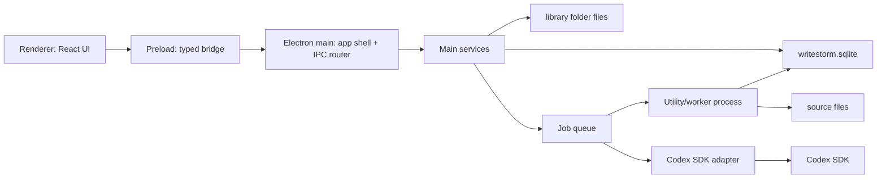

# WriteStorm Technical Design

日期：2026-07-05  
状态：活跃 V1 技术方案；实现 schema 已同步至 migration 007
范围：拆解工作台优先路线的工程技术方案，不包含 UI 高保真、不包含真实 AI 拆解实现、不包含原创小说项目。

## 1. Summary

WriteStorm V1 采用 Electron + React + TypeScript 构建 Windows 11 和 macOS 双桌面端，不提供 Web 运行版。应用以 SQLite 作为唯一事务性主事实源，JSON/Markdown 只作为导出、镜像或人类可读产物。AI V1 只允许接入 Codex SDK；如果 Codex SDK spike 不能满足结构化输出、取消、日志、鉴权和打包运行要求，V1 AI 能力阻塞，不回退到 `codex exec`、app-server、GUI app 自动化或其他供应商。

Task 20 recertifies the foundation around schema epoch 2 and migrations 001/002. The implemented registry now continues through migrations 003–007 for analysis-module definitions/instances/placeholders and TypeLibrary reference/Book-binding facts. Library open is `readonly probe -> readonly backup when migration is pending -> writable open -> migrate -> resulting-schema validation -> publish session`. Repositories and services receive session-bound Units of Work rather than a public SQLite handle. Imported bytes live at `source/{sourceTextId}/{originalFileName}`. Jobs are created queued, transition through policy, and complete with their final checkpoint in one transaction. Renderer server state uses session-scoped TanStack Query keys.

Block 12 freezes seven MainType and seven orthogonal ContentFocus options, user-only Book binding, CAS, active-only selectors and Book-pinned historical display metadata. Technique production tables remain unadmitted: there is no candidate producer, atomic adoption transaction, `TechniqueEntry` persistence, repository/service, or mutation IPC in the implemented schema.

首个实现增量仍是 `docs/tasks/TASK-001-breakdown-workbench-foundation.md`：资料库、拆解书架、导入、结构校正、模块实例骨架、job 状态和导出阻塞态。

## 2. Source Basis

- Product contract: `docs/product/write-storm-product-design.md`
- Flow contract: `docs/product/FLOWS.md`
- Gate task: `docs/tasks/TASK-000-pre-v1-hard-gates.md`
- First increment task: `docs/tasks/TASK-001-breakdown-workbench-foundation.md`
- Electron process/security docs: https://www.electronjs.org/docs/latest/tutorial/process-model and https://www.electronjs.org/docs/latest/tutorial/security
- Electron IPC docs: https://www.electronjs.org/docs/latest/tutorial/ipc
- Electron Forge Vite docs: https://www.electronforge.io/config/plugins/vite
- SQLite app-file format docs: https://www.sqlite.org/appfileformat.html
- Codex official manual: local current cache generated by `openai-docs` helper; relevant sections are Codex SDK, app-server and non-interactive mode.

## 3. Stack Decisions

| Layer | Decision | Reason |
| --- | --- | --- |
| Desktop shell | Electron Forge + Vite | Cross-platform desktop packaging, Vite dev loop, Electron process model |
| UI | React + TypeScript | Mature component ecosystem and strict typed UI state |
| Language | TypeScript strict mode | Shared types across main/preload/renderer/services |
| Main store | SQLite | Transactional local app-file store, strong migration and recovery story |
| SQLite access | `better-sqlite3` in main/utility service | Simple transactions and deterministic local writes; keep heavy work off renderer |
| Renderer state | TanStack Query | UI treats main process services as the data source, not as local truth |
| Runtime validation | Zod | Validate IPC requests/responses and imported/exported structured payloads |
| Unit/integration tests | Vitest | TypeScript-friendly tests for shared, main and service code |
| Renderer tests | React Testing Library | Component tests for empty/error/recovery UI states |
| E2E tests | Playwright for Electron | Real desktop entry-path verification |
| IPC | Typed allowlisted channels | Renderer cannot access fs, SQLite, Codex SDK or shell APIs directly |
| AI | Codex SDK only in V1 | V1 admission decision; no fallback to exec/app-server/other providers |
| Package manager | npm | Keep initial scaffold ordinary and compatible with Electron Forge docs |

## 4. Process Architecture


```mermaid
flowchart LR
  Renderer["Renderer: React UI"] --> Preload["Preload: typed bridge"]
  Preload --> Main["Electron main: app shell + IPC router"]
  Main --> Services["Main services"]
  Services --> SQLite["writestorm.sqlite"]
  Services --> LibraryFiles["library folder files"]
  Services --> Jobs["Job queue"]
  Jobs --> Worker["Utility/worker process"]
  Worker --> SQLite
  Worker --> SourceFiles["source files"]
  Jobs --> Codex["Codex SDK adapter"]
  Codex --> CodexSDK["Codex SDK"]
```

### Long-term AI provider boundary

The long-term direction is `Job/Pipeline -> AiExecutionPort -> ProviderAdapter`. Each provider adapter owns its SDK types, authentication, event protocol, cwd/config requirements, cancellation semantics, error mapping and packaged runtime. Provider selection is explicit; provider failure never causes a silent switch to another adapter.

Codex is the first V1 adapter, but Codex SDK types, CLI/JSONL events, Git/cwd requirements and child-process semantics must not spread into `JobService`, SQLite public models, renderer, shared DTOs or analysis-module domain objects. Task 6A does not implement the production `AiExecutionPort`, and Task 6A does not implement formal provider registry, non-Codex adapters, dynamic provider loading or a real AI workflow. It creates a Codex-specific feasibility probe only.

The Task 6A runtime is governed by `docs/engineering/block6a-feasibility-harness-exit-plan.json`. No current feasibility file becomes the production port or adapter in place. Five low-level environment, process-identity and supervision files are `extract-then-delete`: Task 13 may independently extract their reviewed semantics behind new production contracts, then must delete the original feasibility files. Every probe protocol, runner, synthetic validator, evidence producer and probe utility entry is `delete-without-promotion`. Before Task 13.2 authorization, production code must have a mechanical no-import boundary against `src/main/codex-feasibility`. Before the first product AI execution, that entire source tree must be removed and any still-required certification harness must live outside the product source/build graph. Task 17 release readiness additionally requires the replacement certification path to pass on its final artifact.

### Task 13.3 production AI execution boundary

The reviewed `@openai/codex-sdk@0.144.6` runtime is a server-side ESM API. Its installed implementation resolves and starts the SDK-owned pinned project-local CLI and JSONL mechanism. That mechanism is private to the independently gated provider adapter: it is not a WriteStorm direct `codex exec` fallback. Product main-process services and utilities must never spawn `codex exec` directly, parse its JSONL protocol, search `PATH` for a global executable, call app-server or switch to another provider after a failure.

The production seam begins at `src/main/ai/ai-execution-port.ts` as one non-generic `AiExecutionPort`. `AiExecutionRequest`, `AiExecutionEvent` and `AiExecutionHandle` are application-owned nominal interfaces sealed by unexported `unique symbol` brands. The brands are type-only and never enter IPC, SQLite or JSON. They intentionally have no business fields yet: Tasks 13.7–13.9 must add application schemas and validated factories before any value can be minted through a real entry path.

The Codex adapter implements this one application protocol rather than parameterizing it with provider types. Its capability object is fixed and frozen by the adapter; callers cannot inject claims, and compatibility/auth/runtime observations cannot mutate capabilities. Until their owning increments exist, structured output, streamed events and cancellation remain false. SDK, CLI, JSONL, cwd/Git and provider-runtime types stay inside the Codex adapter/utility boundary. Renderer and shared DTOs remain ordinary serializable values and may become branded only after Main validation.

Task 13.3 does not register an adapter, implement a provider registry, add another provider, create a fallback, connect a Job, persist progress or expose IPC. Task 13.3 does not execute an SDK turn. It does not reuse the Block 6A probe runner, command, result or orchestration as a product service. The reviewed SDK mechanism and the Windows evidence remain input evidence, not production runtime code. Current admission wording remains `Conditional Go — Windows feasibility verified; macOS packaged runtime deferred-by-user.`

### Task 13.4 Codex adapter and utility boundary

`CodexProviderAdapter` implements the sealed application port by delegating exactly once to an injected provider-private transport. It is non-generic and exposes only its own fixed frozen capabilities. `CodexUtilityLauncher` accepts one absolute main-bundle directory, resolves only the fixed `codex-utility-entry.js`, and always launches it with an empty argument list, piped stdio and a fixed service name; callers cannot add environment fields, command-line arguments or another executable. The dedicated production utility entry is the only production AI source allowed to import `@openai/codex-sdk`, while direct `@openai/codex` imports remain forbidden.

The production utility rejects every message fail-closed until later Task 13 increments define and locally validate their owned protocol. It exposes no IPC or renderer surface and does not import a Block 6A probe command, result or runner. No SDK turn, auth check or network request is started by this increment. The Forge entry is build-boundary evidence only; packaged runtime admission remains Task 13.11. Cwd/Git, environment/auth, structured output, event projection and lifecycle cleanup remain with Tasks 13.5–13.9 rather than being guessed here.

The SDK root is import-only, so the production CJS utility preserves a runtime `import()` and fails closed if the expected `Codex` export is absent. Production Forge/Vite and the deterministic smoke use one shared utility build configuration; the smoke loads it through Vite's public `loadConfigFromFile` API rather than importing an undeclared transitive loader. The smoke changes only the isolated entry/output and adds a test-only network-guard banner. It starts that instrumented production entry through Electron `utilityProcess.fork`, verifies the exact fixed bundle, imports the SDK without constructing a client or using auth/proxy configuration, sends one unsupported message and observes exit code 28 plus owned temporary cleanup. The guard replaces `fetch`, callback and Promise DNS functions (including both Resolver prototypes), and Node HTTP/HTTPS/TLS/socket entry points before SDK import. It blocks any attempt and persists only installed state, attempt count and a closed operation kind. Missing observation fails; negative witnesses prove `net.connect`, `dns.promises.lookup` and direct `node:dns/promises` calls are blocked. This is build-tree evidence, not the Task 13.11 production-package runtime gate.

### Task 13.5 Codex scratch workspace and Git independence

Each Codex attempt receives a newly created application-owned directory below the real operating-system temporary root. Injected roots are accepted only when their resolved location remains inside that trusted root. The provider-private thread options bind the absolute directory as `workingDirectory` and set `skipGitRepoCheck=true`. Cleanup becomes terminal only after removal succeeds, so a failed deletion remains retryable; repeated successful cleanup is idempotent. The manager does not invoke a shell, initialize a repository, resolve `git.exe`, inspect `PATH` or depend on a user manuscript or Library path.

The explicit Windows packaged certification command removes every Git directory from both the application and SDK utility `PATH`, proves `where git` and `Get-Command git` fail in that same environment, and then runs one fixed public synthetic structured-output turn from a non-Git scratch directory. The versioned compatibility boundary has three independently evaluated fingerprints: supply chain, production protocol, and probe artifact. Any changed layer becomes `stale` fail-closed; production protocol expands all of `src/main/ai`, so a port, adapter, transport, launcher or utility change cannot retain old evidence. A separate artifact record recomputes the packaged executable, ASAR, pinned CLI and required ASAR entry bytes. Evidence `block13-task13-5-windows-no-global-git-packaged-001` records successful strict structured validation, cleanup acknowledgement and absence of owned utility/CLI residuals. It does not create a Job, checkpoint or resumable state, and it does not establish macOS packaged behavior.

### Task 13.6 Environment, configuration and auth observation

`AiRuntimeAuthState` is the provider-neutral application vocabulary: `authenticated | auth_required | auth_expired | permission_denied | auth_runtime_unavailable | unknown`. A Codex observation is accepted only through a strict provider-private parser with exact fields, canonical `observedAt`, no raw error/message/path/environment/credential fields, and source `actual_runtime`. With fresh compatibility, only `authenticated` plus successful execution maps to application `authenticated`; `login_required` maps to `auth_required`; `auth_failed` and `unverified` map to `unknown`. A dedicated `runtime_unavailable` observation alone maps to `auth_runtime_unavailable`. Stale, blocked or unknown compatibility always erases the observation to `unknown`.

The current SDK 0.144.6 evidence supplies successful authenticated turns but no stable structured discriminator for login-required, generic auth failure, expiration or permission denial. `auth_expired` and `permission_denied` therefore have no Codex producer in Task 13.6. Synthetic mapping inputs prove only fail-closed code behavior and are not runtime capability evidence.

`AiRuntimeObservationMemory` stores only the sanitized state, canonical observation time and compatibility fingerprint in Main memory. A fingerprint change or non-fresh assessment immediately clears it; a new instance starts `unknown`, and explicit `clear()` removes the previous result. There is no TTL, timer, automatic refresh, SQLite/Library write, Job/checkpoint, renderer DTO, export field, credential store or log payload. Task 13.12 must clear it when a future explicit connection attempt begins and must not invent independent attempt/generation logic.

The production Codex launcher constructs its own case-insensitive environment allowlist from `process.env`. It passes only Windows runtime locations, ChatGPT/Codex home locations, temporary directories, proxy settings and enterprise certificate paths. API keys, access tokens, authorization values, `NODE_OPTIONS`, `ELECTRON_RUN_AS_NODE` and arbitrary WriteStorm/test configuration never cross the product utility boundary. Values are neither persisted nor logged.

### Task 13.7 Strict structured output contract

`AiStructuredOutputContract` is an opaque Main-only application contract, not a provider type or renderer DTO. Its factory accepts only a Zod strict root object, rejects non-object schemas and every nested object that permits additional properties, derives a standard JSON Schema without provider fields, deep-freezes it, and binds an explicit final-byte limit. The repository-wide ceiling is 1 MiB; later callers may choose only a smaller positive integer.

`validateAiStructuredOutput` checks UTF-8 byte size before parsing, requires a plain JSON object, runs the same application Zod schema, and returns only the closed classifications `accepted | output_too_large | invalid_json | invalid_shape | missing_field | extra_field | invalid_value`. It returns no raw output, Zod issues or error messages. Only accepted JSON is deep-frozen behind `AiStructuredOutputValue`; missing, extra, malformed, wrong-shape, wrong-value and oversized values cannot become application data.

The Codex-private translation reads the frozen standard schema and produces exactly `{ outputSchema }`. It neither imports the SDK nor exposes SDK, CLI, JSONL, cwd/Git or utility protocol types to application/domain/UI layers. Task 13.7 does not add a prompt, executable request, message command, event, handle implementation, Job, checkpoint, persistence, retry or cancellation. The production utility still rejects messages fail-closed and `CODEX_PROVIDER_CAPABILITIES.structuredOutput` remains false. The packaged synthetic evidence confirms the unchanged pinned SDK mechanism; local invalid/missing/extra tests remain separate provenance.

### Task 13.8 In-memory event projection and attempt state

`AiExecutionEvent` is now a sealed application union minted only by its strict factory. Every event has positive attempt, generation and sequence metadata and exactly one of four provider-neutral forms: payload-free `progress`, replace-style `partial`, structured-output `final`, or payload-free `error`. The Codex-private projector parses one bounded JSONL line at a time, requires the current SDK-shaped fields, discards thread/item IDs, raw errors and usage, and maps non-message activity to progress. Agent-message updates and completion remain partial snapshots; only the subsequent `turn.completed` confirmation projects the latest completed agent text as final. A missing completed message, malformed/truncated JSON, unsupported event or oversized line fails with a closed classification and no raw payload.

`AiAttemptController` is the only owner of attempt/generation state. A concurrent start is rejected; every later explicit start increments both counters, and every prior token stays stale permanently. Current events must be exactly ordered from sequence one. Duplicate/out-of-order input produces a failed terminal candidate; duplicate final, final-after-final, events after error/cancel and old-generation late output cannot mutate current state. `endInput` without final/error produces `incomplete_stream`. Task 13.9 may connect cancellation and lifecycle triggers to this controller but must not implement another retry/generation state machine.

The controller enforces explicit caller limits below repository ceilings: 2,621,440 UTF-8 bytes per raw/projected event, 16 MiB total projected bytes, 4,096 events, and 1 MiB retained partial content. Final content additionally passes the Task 13.7 contract's at-most-1-MiB limit and strict local validation. Progress/partial produce an immutable `checkpoint_candidate`; valid final, provider error, cancellation, incomplete input, sequence violation or resource exhaustion produce an immutable `terminal_state_candidate`. These are Main-memory values only, not `JobCheckpoint` or Job state. Task 13.8 creates no Job, AnalysisModuleInstance, migration, SQLite/Library write, durable recovery or resumable claim.

Default Task 13.8 tests use recorded SDK-shaped lines and injected pure state; they are offline, deterministic and authentication-free. The production utility still rejects messages fail-closed, and all Codex adapter capabilities remain false because the projector/controller are not wired to an executable request or handle. Fresh Windows certification evidence separately rebinds the compatibility and artifact fingerprints after the production-protocol change; it does not convert fixtures into runtime malformed/late-event evidence and does not establish macOS behavior.

### Task 13.9 Lifecycle, cleanup and explicit retry

`AiAttemptLifecycleService` composes the existing `AiAttemptController`; it does not own attempt or generation counters. The initial attempt and every later retry require separate explicit calls. Concurrent starts/retries are rejected, the first termination trigger is single-flight, and a bounded timeout requests termination without automatically creating another attempt. Events received after termination begins cannot mutate state. A completed/failed stream candidate is withheld until cleanup finishes; forced or unverified cleanup overrides it with a closed failure candidate.

The Codex-private lifecycle protocol admits only exact, correlated `ai.abort` and `ai.shutdown` utility messages containing an application token and closed trigger. It contains no prompt, path, PID, raw error or provider payload. Cleanup proceeds through abort observation, execution settlement, shutdown acknowledgement and actual utility exit. Only an ownership-proven live utility may enter the force-kill fallback, and every path ends in a bounded residual utility/CLI scan. Missing evidence is `unverified`, never inferred success.

`AiRuntimeLifecycleRegistry` pauses admission before it snapshots Library replacement, window close or app quit work and fans termination into all tracked active sessions. Attempts arriving after close begins are rejected, and active or quarantined participants cannot unregister out of lifecycle ownership. Main waits for cleanup alongside existing Job/structure/source-import lifecycle work and reports a window-close cleanup failure only as a static sanitized code. All cleanup observations and checkpoint/terminal candidates remain in Main memory. No AI IPC, Job, checkpoint, AnalysisModuleInstance, migration, SQLite/Library write, durable recovery or resumable state is introduced.

The deterministic production-utility smoke uses the shared Vite configuration and two independent hidden Electron processes. One proves fail-closed exit 28 for unsupported input; the other proves a valid lifecycle-only shutdown acknowledgement followed by exit 0. The installed network guard must report zero attempts, and no SDK client/turn or authentication is used. The separate Windows packaged no-Git synthetic probe is rerun only after compatibility drift and retains its own provenance. It does not prove a real production lifecycle execution; that packaged runtime gate remains Task 13.11. Adapter capabilities therefore remain false.

Task 13.9 review remediation makes the pre-execution boundaries fail closed under adversarial inputs. `CodexStreamEventProjector` receives explicit raw byte and frame budgets and charges them before JSON parsing, so ignored provider fields cannot bypass the application projected-byte budget. Structured-output contracts reject every known Zod rewrite surface (coercion, default, catch, prefault, pipe/transform, readonly and overwrite checks) and also require parsed JSON to equal validated output.

Auth storage exposes a read-only application memory. Its write capability is owned by `CodexAuthObservationAuthority`, which accepts only the strict actual-runtime input union before applying the fixed provider-neutral mapping. A TypeScript AST/import gate covers all of `src/main` and rejects any other production importer of the authority factory; `@internal` comments or forgeable structural receipts are not security boundaries. `AiAttemptLifecycleService` constructs its controller privately and publishes terminal settlement only through the cleanup-completed lifecycle outcome. Its idle promise begins with the attempt and resolves only after positively safe cleanup. Unverified cleanup remains quarantined: retry and Library replacement fail closed rather than opening another generation. A utility exit is graceful only when shutdown was acknowledged and exit code/signal proves a clean exit; abnormal exit remains unverified even when the utility sent an acknowledgement first. If timeout scheduling throws or returns an invalid cancellation handle, start returns a sanitized failure and immediately enters the same cleanup/quarantine path rather than leaving a live attempt without a timeout.

### Task 13.10 Errors, usage, diagnostics and release limits

The application owns five stable AI error codes: `AI_AUTH_ERROR`, `AI_RATE_LIMITED`, `AI_SCHEMA_INVALID`, `AI_NETWORK_UNAVAILABLE` and `AI_RUNTIME_UNAVAILABLE`. A branded failure observation must come from the composition-owned authority before it can become a `DomainError`. Auth, rate and network observations require a structured runtime discriminant; schema failure is local validation; every unknown SDK/CLI failure remains runtime unavailable. The current Codex authority deliberately exposes only local-schema and unknown-runtime producers and never classifies an English message.

Usage crosses the provider boundary only as `reported` or `unknown`. Reported usage requires exact non-negative safe-integer input, cached-input and output token fields; absence, extra fields or invalid values produce unknown. The application never inserts zeros, derives a total, prices tokens, estimates cost or performs budget confirmation. Usage may accompany an in-memory successful terminal candidate but is not persisted.

`AiDiagnosticLog` is a maximum-256-entry in-memory ring containing only frozen closed records. It accepts no free-form prompt, response, error, path, environment, credential or provider identifier field and has no filesystem, console, network or remote telemetry behavior. `config/block13-release-limitations-v1.json` separately records platform, clean-machine, signing/notarization, Defender, proxy, certificate, firewall, offline, telemetry and redistribution constraints. No Task 13.10 surface adds IPC, Job/checkpoint writes, SQLite, automatic retry or a product execution path.

### Task 13.11–13.12 packaged runtime and explicit Settings check

Task 13.11's dated Windows development-machine artifact proves its recorded product Main, launcher, utility, success/cancel/timeout and cleanup boundary. It does not permanently authorize later builds. The build-time compatibility evaluator independently fingerprints supply chain, production protocol and probe artifact inputs; changing any relevant product AI, typed IPC, preload, Settings or build-authority source makes the prior runtime observation unusable.

The current recertification binds clean runtime HEAD `f4e6adc2d106946de39563da1da4ed986c4caed8` to compatibility fingerprint `c70e0d116d0bcada33c381701faee7a90b6e28570eeff8be82020f50c10807d1`. The real product artifact passed isolated success, cancel and timeout, while the separate certification artifact passed all 17 no-global-Git assertions. These records make the next unchanged build's compatibility projection fresh; they do not create or persist an auth observation. Before the explicit action, default packaged E2E renders compatibility/auth as unknown and never clicks the real connection action; the response to that action is the only renderer-visible compatibility projection.

Task 13.12 adds exactly one product channel, `ai:check-connection`. Its request schema is strict `{}` and its response contains only provider-neutral Gate, compatibility and runtime/auth observation fields. `config/block13-ai-gate-v1.json` is the single versioned application Gate authority; `src/shared/contracts/ai-gate.ts` validates it strictly and projects the same frozen value to Main and renderer. The release-limitation matrix references that authority instead of copying its verdict. Compatibility is injected from the build fingerprint; auth/runtime observation is ephemeral Main memory with `observedAt`. These layers never overwrite one another.

Settings starts no check on application startup, render, Library open or navigation. Only the visible button invokes the fixed short synthetic utility request. The renderer has no prompt, schema, SDK, filesystem, process, token or raw IPC surface. Only an admitted check clears the previous displayed/runtime observation; paused, concurrent, quarantined or failed admission preserves the last still-valid result. The application service delegates admission, attempt/generation, timeout and cleanup to the existing `AiAttemptLifecycleService`/`AiAttemptController`; concurrent checks do not create another generation. Library replacement and window close invalidate observation before lifecycle termination, and a Settings component that unmounts ignores its late IPC response.

Scratch workspaces are private random directories created directly beneath a realpath-validated OS temporary root. Creation and cleanup both revalidate the owned directory and reject link/reparse substitution before removal. Window, Library and shutdown admission pauses are independently reference-tracked; a macOS replacement window resumes only its window-close reason after the prior cleanup barrier settles. Ownership-proven force termination treats `kill() === false` as immediate unverified failure, bounds the exit wait after an accepted kill and releases lifecycle listeners when exit cannot be observed.

The Codex-private utility owns the fixed input and strict one-field schema, uses an OS-temp non-Git scratch directory with `skipGitRepoCheck=true`, and emits only `authenticated` or `runtime_unavailable`. It does not infer login-required, expiration, permission, network or rate classifications from messages. Main promotes authenticated only after strict output and graceful cleanup under the same fresh fingerprint. All other or stale cases remain unknown/runtime-unavailable as defined by D104.

Observation is never written to Library SQLite, Job, checkpoint, export, log or credential storage. Restart begins unknown; fingerprint drift immediately invalidates prior observation; time passage alone does not refresh it, and no TTL is invented. AI generation actions remain disabled. Default unit/integration/UI tests inject transport and remain offline; a real packaged check is never part of `npm run check`.

### Main process

Owns:

- App lifecycle, windows, menus and native dialogs.
- Library folder selection and trusted path checks.
- SQLite connection, migrations and transactions.
- Service registration and typed IPC handlers.
- Job queue orchestration.
- Codex SDK adapter lifecycle after spike passes.

Does not own:

- React rendering.
- Direct rich-text editing.
- Large CPU-bound parsing on the UI path.

### Preload

Owns:

- `contextBridge` exposure of a narrow `window.writestorm` API.
- Request/response typing for IPC channels.
- No business logic beyond argument shape forwarding.

Rules:

- No raw `ipcRenderer` exposure.
- No fs, SQLite, shell or Codex SDK exposure to renderer.
- Every exposed method maps to a named main-process handler.

### Renderer

Owns:

- Book shelf UI.
- Import wizard UI.
- Structure review and freeze UI.
- Breakdown workbench UI.
- Job status and recovery UI.
- Export blocked/available UI.

Rules:

- Treats SQLite data as remote service data accessed through typed IPC.
- Holds only view state and cached query results.
- Cannot write files, open SQLite, spawn processes or call Codex.

### Utility/worker process

Owns work that may block:

- File hash and encoding detection.
- Large text scanning.
- Chapter/title candidate extraction.
- Future Codex SDK execution if spike proves this is the stable process boundary.

Rules:

- Reports progress through `JobService`.
- Uses checkpointed units.
- Can be cancelled by job id.

## 5. Source Tree Target

First implementation should create this shape:

```text
package.json
forge.config.ts
vite.main.config.ts
vite.preload.config.ts
vite.renderer.config.ts
tsconfig.json
src/
  main/
    main.ts
    windows/
    ipc/
    services/
    db/
    jobs/
    codex/
  preload/
    index.ts
  renderer/
    App.tsx
    routes/
    features/
    components/
    styles/
  shared/
    contracts/
    domain/
    errors/
    ids.ts
tests/
  unit/
  integration/
  e2e/
```

No implementation task may put privileged Node APIs under `src/renderer`.

## 6. Library Folder Contract

```text
library-root/
  manifest.json
  writestorm.sqlite
  source/
    breakdown-books/
      {book-id}/
        original.txt
  exports/
    {export-id}/
  logs/
  cache/
  mirrors/
    markdown/
    json/
```

Rules:

- `writestorm.sqlite` is the only main fact source, including authoritative schema version through SQLite `schema_migrations`.
- SQLite `schema_migrations` is the authoritative schema-version source.
- SQLite `library` row owns library identity once the database exists; `LibrarySummary` must read id, name and app version from SQLite, not manifest identity fields.
- `manifest.json` stores library identity, `manifestVersion`, app version, database filename, and optional `schemaVersionHint` diagnostic metadata. `schemaVersionHint` must never override SQLite `schema_migrations`.
- `source/` stores immutable imported source copies.
- `exports/` stores user-created export packages.
- `logs/` stores user-visible local logs under the configured log policy.
- `cache/` is rebuildable.
- `mirrors/` is derived from SQLite and can be rebuilt; it never overrides SQLite automatically.

## 7. SQLite Schema Contract

Admitted tables through migration 007:

| Table | Purpose |
| --- | --- |
| `schema_migrations` | Applied migrations and timestamps |
| `library` | Library identity row owned by SQLite, not by manifest |
| `books` | `BreakdownBook` records and lifecycle state; `books.current_source_text_id` references `source_texts.id` |
| `source_texts` | Imported file metadata, hash, encoding and source edition |
| `jobs` | Import, structure, analysis placeholder and export jobs |
| `job_checkpoints` | Ordered durable Job progress and completion facts |
| `structure_detection_runs` | Persisted detection-run identity and causal sequence |
| `structure_sets` | Candidate/draft/frozen structure aggregate headers |
| `structure_nodes` | Title tree nodes for book/volume/chapter |
| `story_segment_ranges` | Cross-chapter story segment scopes |
| `story_segment_range_chapters` | Ordered range-to-chapter membership |
| `analysis_modules` | Stable module definitions |
| `analysis_module_instances` | Module + scope instances, body, status and revision |
| `type_definitions` | Immutable MainType/ContentFocus identities with one-way archive retirement |
| `type_definition_versions` | Immutable versioned display name and selection description |
| `type_library_versions` | Immutable TypeLibrary release headers |
| `type_library_version_entries` | Exact release membership, kind and stored display order |
| `book_type_bindings` | Book-owned current classification target with `expectedRevision` CAS |
| `book_content_focus_bindings` | Zero-to-three ordered ContentFocus references owned by a Book binding |

Migration 005 adds admitted placeholder columns to `analysis_module_instances`; it does not create speculative evidence, relation, Technique, perspective, export, Prompt, or snapshot tables. Technique production tables remain unadmitted until identity, producer, immutable `SourceSnapshot` capture transaction and real read/write lifecycle are separately approved.

Version fields:

- `source_text_edition`: source content, encoding normalization or source correction.
- `structure_edition`: title tree, chapter boundaries and story range changes.
- `analysis_revision`: module body edits, rerun acceptance and structured analysis changes.

Migration rules:

- All schema changes go through numbered SQL migrations.
- App startup runs pending migrations in a transaction after backing up or snapshotting the database according to the migration policy.
- Migration startup validates applied migration id/name history against the static migration registry. Unknown future migrations and id/name mismatches must reject open before pending migrations run.
- applied migrations must be a contiguous prefix of the static registry; a database with migration 2 applied and migration 1 missing is invalid.
- Failed migration leaves the original database usable or explicitly marks it blocked with a recoverable reason.

## 8. Service Contracts

| Service | Responsibility |
| --- | --- |
| `LibraryService` | Create/open library, validate manifest, open database, run migrations |
| `BookService` | List/create/update `BreakdownBook` records |
| `SourceTextService` | Copy txt/md source, detect encoding, compute hash, record metadata |
| `StructureService` | Manage `StructureNode`, `StorySegmentRange`, freeze/unfreeze and structure edition |
| `ModuleInstanceService` | Create/read/update module instance shells, body revisions and stale state |
| `TypeLibraryService` | List active release options, read Book binding detail with pinned display metadata, and apply Book CAS updates |
| `JobService` | Create jobs, update state, checkpoints, cancellation and recovery |
| `ExportService` | Report export availability and build export packages later |
| `AiExecutionPort` | Future provider-neutral production execution contract; not implemented by Task 6A |
| `CodexProviderAdapter` | Future V1 Codex implementation behind `AiExecutionPort`; must be designed independently of the Task 6A harness |
| `TypedIpcBridge` | Shared renderer-to-main contract and runtime validation |

Service rules:

- Renderer calls services only through typed IPC.
- Services return domain errors with stable codes.
- Services never return raw SQLite rows directly to renderer.
- Structure detection runs receive a positive per-book `run_sequence` inside the aggregate write transaction. Latest-run, active-run, recovery, and manual-fallback authorization order only by this persisted sequence, never by wall-clock timestamps or UUID text.
- Structure freeze invokes the synchronous DB-only `StructureEditionChangePort` inside its aggregate transaction. The port emits `needs_rebuild`/`stale`/`needs_refresh` plus a non-persisted future CompletionGate invalidation instruction; it never starts downstream work.
- Long work emits job progress instead of blocking request IPC.
- `LibraryService.create` is the only flow allowed to create `writestorm.sqlite`; it requires an absent or empty library root and must not adopt an existing database without a valid create flow.
- `LibraryService.open` requires both `manifest.json` and `writestorm.sqlite`; it must not recreate a missing database for an existing library.

## 9. IPC Contract

IPC channels must be grouped by service and action:

```text
library:create
library:open
library:get-current
books:list
books:import-source
type-library:list-options
type-library:get-book-binding
type-library:update-book-binding
structure:get
structure:update-node
structure:update-story-range
structure:freeze
modules:list-instances
modules:update-body
jobs:list
jobs:get
jobs:cancel
exports:get-status
```

Rules:

- Request and response schemas live in `src/shared/contracts`.
- Runtime validation is required at the IPC boundary.
- Renderer never passes arbitrary file paths except through explicit open/create dialogs handled in main.
- Main validates that all library paths stay within the selected library root unless the action is a user-selected import source.

## 10. Job and Checkpoint Design

Job states:

```text
queued -> running -> paused -> failed -> resumable -> cancelled -> completed
```

Checkpoint units:

| Job type | Unit |
| --- | --- |
| Import | source copy + metadata |
| Structure detection | structure draft |
| Structure freeze | structure edition |
| Module shell creation | module instance batch |
| Export | export manifest and blocked reason |
| Future AI analysis | `AnalysisModuleInstance` batch |

Rules:

- `Job` state is separate from `Book` state and `AnalysisModuleInstance` state.
- Cancelled imports keep no partial book unless source copy and metadata are valid.
- Failed jobs keep completed checkpoints and expose recovery actions.
- First increment may use placeholder jobs but must use the real job state model.

## 11. Codex SDK Gate

Codex SDK is the only V1 AI integration target.

Compatibility spike must verify:

- TypeScript SDK can be installed and run in the chosen Electron process boundary.
- Auth/session behavior is understandable to the app and can be surfaced in settings.
- A sample breakdown prompt can produce a machine-checkable structured result.
- Calls support app-level timeout and cancellation behavior, either directly or through the process boundary.
- Errors map to `Job` failures with stable codes.
- Prompt/response logging follows local log policy and can exclude sensitive source text from export.
- Packaged Windows 11 and macOS builds can run the chosen SDK path.

If any required item fails, V1 AI work is blocked. Do not switch to `codex exec`, app-server, GUI automation, API Key, local model or other providers without a new product decision.

## 12. Test Strategy

Required verification layers:

- Unit tests for domain mapping, IDs, migration helpers and path guards.
- Main-process integration tests for SQLite migrations and services.
- Renderer component tests for empty/error/recovery states.
- IPC contract tests proving renderer has no direct fs/SQLite/Codex access.
- E2E tests for fresh start, import, structure freeze, module shell, job recovery and export blocked state.
- Codex SDK spike tests before any AI feature work.

Initial commands to define in the scaffold:

```powershell
npm run typecheck
npm run test:unit
npm run test:e2e
npm run build
```

The first implementation plan must add the exact commands once the scaffold exists.

## 13. Implementation Sequence

1. Scaffold Electron Forge + Vite + React + TypeScript with strict TypeScript.
2. Add Electron security baseline: context isolation on, node integration off, sandboxed renderer, IPC allowlist.
3. Add shared contracts and domain types.
4. Add SQLite connection and migration runner.
5. Implement library create/open.
6. Implement txt/md import and source metadata.
7. Implement structure and story range shells.
8. Implement module instance shell and job state.
9. Implement export blocked state.
10. Run Codex SDK spike as a separate gate before AI breakdown.

## 14. Explicit Non-Goals

- No Web app deployment target.
- No real AI breakdown in the first workbench foundation increment.
- No fallback AI provider.
- No arbitrary Markdown-to-SQLite structural import.
- No renderer-side filesystem or SQLite access.
- No automatic external file watcher in the first increment; external changes are detected by explicit open/health-check/repair flows.
- No Technique production table, candidate adoption transaction, `TechniqueEntry` repository/service, or editable Technique detail until the deferred lifecycle is admitted.
