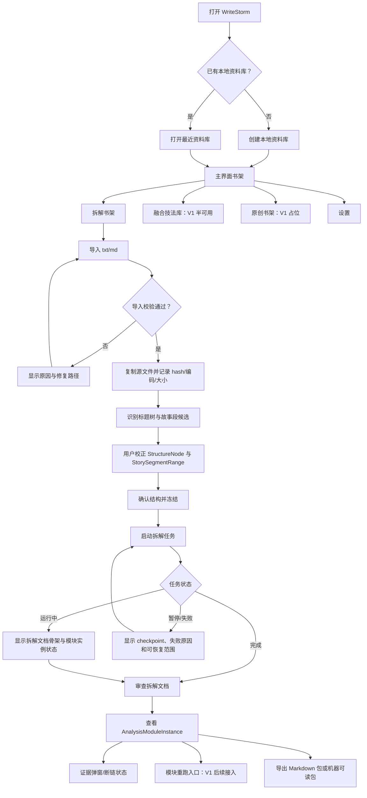

# WriteStorm V1 Flow Map

范围：本文档描述“拆解工作台优先”路线的 V1 首轮用户路径，用于把产品设计转成后续任务包和实现验收。本文不是高保真视觉稿，不定义技术栈，不表示最终 UI 布局。

## 1. Flow Principles

- 拆解书架是 V1 主入口；融合技法库半可用；原创书架只占位。
- `BreakdownBook` 是当前工作对象，`AnalysisModuleInstance` 是后续审查、重跑、diff 和导出的最小工作单元。
- `StructureNode` 只表示标题树；`StorySegmentRange` 表示可跨章节的故事段范围，二者不能混为一个层级。
- SQLite 是主事实源；JSON/Markdown 是导出、镜像或人类可读产物；Markdown 只承载模块正文阅读和正文编辑。
- 真实 AI 拆解、Codex SDK 集成和完整模板系统不属于第一个工作台基础增量；第一增量只要能承接这些未来能力。

## 2. Primary User Flow



## 3. Product Surface Flow

| Surface | Current object | User can view | User can do | Writes to | Guard state |
| --- | --- | --- | --- | --- | --- |
| 首次启动 | `Library` | 资料库空态、最近资料库入口 | 创建或选择本地资料库 | library manifest | 路径可写 |
| 主界面书架 | `Library` | 拆解书架、融合技法库入口、原创占位 | 进入可用区域 | 无 | 资料库已打开 |
| 拆解书架 | `BreakdownBook` 列表 | 书名、导入状态、任务状态 | 导入、打开、继续任务 | book index | 源文件校验 |
| 导入向导 | `SourceText` | 文件名、大小、编码、格式 | 选择文件、指定编码、取消 | source copy + metadata | txt/md |
| 结构校正 | `StructureNode` + `StorySegmentRange` | 标题树、故事段候选、置信度 | 调整标题层级、调整故事段范围、确认冻结 | structure edition | 源文本存在 |
| 拆解任务 | `Job` | 进度、checkpoint、失败原因 | 启动、暂停、恢复、取消 | job state | 结构已冻结且 AI Gate 可用 |
| 任务恢复 | `Job` | checkpoint、已完成实例、失败原因 | 恢复、取消、保留草稿 | job state | 存在可恢复 checkpoint |
| 拆解工作台 | `AnalysisModuleInstance` | 模块正文骨架、scope、状态、证据状态 | 查看、编辑正文、进入审查入口 | module instance revision | 结构已冻结 |
| 证据弹窗 | `EvidenceAnchor` | 摘录、位置、有效性 | 查看原文、标记待重建 | evidence state | anchor 存在 |
| 导出 | `BreakdownBook` | 导出内容预览、缺失项 | 导出 Markdown 包、导出机器包 | export package | 必要资产有效 |
| 融合技法库 | `TechniqueEntry` | 已采纳条目、来源快照 | 查看和整理已存在条目 | technique library | V1 不发布门禁 |
| 原创书架 | 无 | 占位说明 | 无创建动作 | 无 | V1 不可用 |

## 4. Empty, Error, Recovery States

| State | Trigger | Required user-facing result | Next action |
| --- | --- | --- | --- |
| 无资料库 | 首次启动或最近资料库不可访问 | 显示创建/选择资料库入口 | 用户选择本地路径 |
| 空拆解书架 | 资料库存在但没有 `BreakdownBook` | 显示导入第一本书入口 | 用户导入 txt/md |
| 无 Codex SDK 可用配置 | Codex SDK 未验证、未授权或不可用 | 显示 Codex 不可用，不阻止导入和结构校正 | 用户先做离线骨架，后续完成 SDK spike |
| 导入格式不支持 | 文件不是 txt/md | 显示格式限制 | 用户选择支持文件 |
| 编码识别失败 | 自动解码失败 | 显示编码选择入口 | 用户手动指定编码 |
| 空文件 | 文件无有效正文 | 显示不可导入原因 | 用户更换文件 |
| 超大文件 | 文件超过当前性能基线 | 显示风险和取消入口 | 用户确认或取消 |
| 章节识别失败 | 标题树置信度低 | 进入手动结构校正 | 用户手动建标题层级 |
| 故事段候选不可靠 | story segment range 置信度低 | 显示候选和“不采用故事段”选项 | 用户调整或跳过 |
| 任务中断 | 应用关闭、请求失败、进程异常 | 显示 checkpoint 和可恢复范围 | 用户恢复或取消 |
| 证据断链 | source/structure edition 变化 | 标记待重建并显示失效来源 | 用户触发局部重建 |
| 导出缺失 | 必要资产未确认或证据不足 | 显示阻塞项列表 | 用户补审或导出草稿包 |

## 5. First Increment Boundary

`TASK-001-breakdown-workbench-foundation.md` 只要求实现或设计到以下路径可被验证：

1. 用户能创建或选择本地资料库。
2. 用户能进入拆解书架并导入 `.txt` 或 `.md`。
3. 系统能复制源文件并展示导入元数据。
4. 用户能看到标题树和故事段范围的校正入口。
5. 用户能冻结结构并看到基础 `AnalysisModuleInstance` 骨架。
6. 用户能看到任务状态、暂停/失败/恢复的入口形态。
7. 用户能看到导出入口和当前不可导出的原因。

不要求真实 AI 输出、真实 Codex SDK 集成、完整证据抽取、模块重跑 diff 或融合技法库深度整理。

## 6. AI-Readable Flow Contract

```yaml
flow_id: breakdown_workbench_v1
primary_domain: breakdown_shelf
source_documents:
  - docs/product/write-storm-product-design.md
  - docs/vibecoding-workflow.md
current_increment:
  task: docs/tasks/TASK-001-breakdown-workbench-foundation.md
  includes:
    - library_gate
    - breakdown_shelf
    - txt_md_import
    - structure_review
    - story_segment_range_review
    - module_instance_shell
    - job_state_shell
    - basic_export_entry
  excludes:
    - real_ai_analysis
    - codex_sdk_integration
    - original_project_creation
    - prompt_gate_publication
    - full_technique_fusion
key_objects:
  - Library
  - BreakdownBook
  - SourceText
  - StructureNode
  - StorySegmentRange
  - AnalysisModule
  - AnalysisModuleInstance
  - Job
  - EvidenceAnchor
state_requirements:
  empty_states:
    - no_library
    - empty_breakdown_shelf
    - no_ai_connector
  error_states:
    - unsupported_file
    - encoding_failure
    - empty_file
    - chapter_detection_failure
  recovery_states:
    - job_interrupted
    - evidence_stale
```

## 7. Flow Quality Checks

- 每个顶层入口都有明确产品责任：资料库、拆解书架、融合技法库、原创占位、设置。
- 每个工作台叶节点都有当前对象、可看内容、可做动作、写入位置和守卫状态。
- 空态、错态、恢复态覆盖首次启动、导入、结构校正、任务中断、证据失效和导出阻塞。
- 本文只声明低保真流程，不声明高保真视觉或交互验收已完成。
