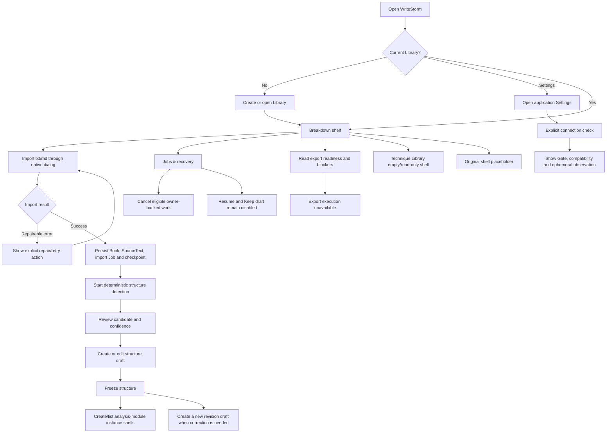

# WriteStorm V1 Current Product Flows

Document class: **CURRENT USER-VISIBLE FLOW / FUTURE CAPABILITIES EXPLICITLY SEPARATED**

This document describes the natural user paths present in the checked-out V1 implementation. It is an
acceptance map, not a high-fidelity visual specification. Product direction that is not listed as
implemented here must not be inferred from historical TASK-001 wording or future Block plans.

## 1. Current flow principles

- The Breakdown shelf is the primary working area.
- SQLite is the transactional fact source. JSON and Markdown are derived export, mirror or
  human-readable artifacts.
- Imported immutable bytes use `source/{sourceTextId}/{originalFileName}`.
- The Technique Library is a truthful empty/read-only shell; the Original shelf is a disabled
  placeholder.
- Analysis-module instances currently provide persisted shells and readiness/status presentation.
  Production AI module-body generation is not implemented.
- A visible affordance is not an executable capability unless this document lists the action as
  enabled.

## 2. Implemented natural path


```mermaid
flowchart TD
  Start["Open WriteStorm"] --> LibraryGate{"Current Library?"}
  LibraryGate -->|No| NoLibrary["Create or open Library"]
  LibraryGate -->|Settings| Settings["Open application Settings"]
  NoLibrary --> Breakdown["Breakdown shelf"]
  LibraryGate -->|Yes| Breakdown

  Breakdown --> Import["Import txt/md through native dialog"]
  Import --> ImportResult{"Import result"}
  ImportResult -->|Repairable error| Repair["Show explicit repair/retry action"]
  Repair --> Import
  ImportResult -->|Success| Book["Persist Book, SourceText, import Job and checkpoint"]

  Book --> Detect["Start deterministic structure detection"]
  Detect --> Candidate["Review candidate and confidence"]
  Candidate --> Draft["Create or edit structure draft"]
  Draft --> Freeze["Freeze structure"]
  Freeze --> ModuleShells["Create/list analysis-module instance shells"]
  Freeze --> Unfreeze["Create a new revision draft when correction is needed"]

  Breakdown --> Jobs["Jobs & recovery"]
  Jobs --> Cancel["Cancel eligible owner-backed work"]
  Jobs --> DisabledRecovery["Resume and Keep draft remain disabled"]

  Breakdown --> ExportStatus["Read export readiness and blockers"]
  ExportStatus --> ExportDisabled["Export execution unavailable"]

  Breakdown --> Technique["Technique Library empty/read-only shell"]
  Breakdown --> Original["Original shelf placeholder"]
  Settings --> ConnectionCheck["Explicit connection check"]
  ConnectionCheck --> Observation["Show Gate, compatibility and ephemeral observation"]
```

## 3. Product surfaces

| Surface | Current user-visible state | Enabled actions | Explicitly unavailable |
| --- | --- | --- | --- |
| No Library | Create/Open Library entry and application Settings | Create Library, Open Library, open Settings | Breakdown work without a Library |
| Breakdown shelf | Persisted Book list, opened Book, import and workspace state | Import txt/md, open persisted Book | Arbitrary renderer filesystem paths |
| Import repair | Stable failure reason and applicable repair actions | Retry supported encoding, choose another/smaller file, open existing duplicate where offered | Silent overwrite or merge |
| Structure workspace | Detection state, candidate/draft/frozen aggregate, confidence and blockers | Detect, recover/retry, create/edit/discard draft, freeze, unfreeze | AI narrative-arc inference |
| Jobs & recovery | Library-wide persisted Job list/detail, progress, checkpoint metadata and failure reason | Cancel only when Job policy and runtime owner allow it | Resume; executable Keep draft |
| Analysis workbench | Analysis-module instance shells, scope/status/readiness | View current shells | Production AI generation, generated module body, rerun diff |
| Export readiness | Read-only target readiness and blocker explanation | View status | Export execution |
| Technique Library | Truthful empty state and future provenance position | Navigate/view shell | Create, edit, adopt, merge or persist TechniqueEntry |
| Original shelf | Placeholder and disabled creation affordance | Navigate/view reason | Create Original project |
| Settings | Gate, compatibility and ephemeral runtime/auth observation | Explicit connection check | Automatic check, production AI generation, enabled maintenance shells |

## 4. Empty, error and recovery states

| State | Trigger | Required result | Available next action |
| --- | --- | --- | --- |
| No Library | First launch or no active Library | Show Create/Open and Settings | Create/Open Library |
| Empty Breakdown shelf | Library has no Book | Show import entry | Import txt/md |
| Unsupported/empty/oversized source | Import preflight rejects selection | Show stable reason | Choose another/smaller file |
| Encoding required | Automatic decode is insufficient | Keep main-owned pending token | Retry with an admitted encoding |
| Duplicate source | Canonical hash already exists | Show existing Book/SourceText identity | Open existing Book |
| Structure detection failure | Deterministic detector cannot produce usable candidate | Preserve imported Book and Job result | Retry/recover or create manual draft where admitted |
| Low-confidence structure | Candidate needs review | Show confidence and blockers | Correct/accept according to workspace policy |
| Revision conflict | Draft changed since edit began | Preserve current aggregate | Reload and retry deliberately |
| Source/structure stale | Source or edition no longer matches | Keep history readable and block unsafe freeze | Recover/redetect or create a new revision |
| Interrupted Job | Persisted Job is abandoned or failed | Show failure and checkpoint metadata | Cancel where eligible; Resume remains disabled |
| Export blocked | Required structure/module facts are unavailable | Show blocker list | No export action |

## 5. Not implemented

The following are product direction or later-Block work, not current user capabilities:

- production AI analysis Jobs or generated module content;
- automatic/manual Resume of AI or analysis work;
- executable Keep draft recovery;
- evidence review/mutation workflow;
- module rerun with semantic diff;
- TechniqueEntry persistence, editing, adoption or merge;
- export package execution;
- Original project creation or generated prose;
- Block 14 production-quality validation.

## 6. AI-readable flow contract

```yaml
flow_id: writestorm_current_v1
document_status: current_user_visible_flow
primary_domain: breakdown_shelf
transactional_source_of_truth: sqlite
source_copy_path: source/{sourceTextId}/{originalFileName}
implemented:
  - library_create_open
  - persisted_book_import_and_reopen
  - import_repair_actions
  - deterministic_structure_detection
  - structure_review_draft_freeze_unfreeze
  - analysis_module_instance_shells
  - jobs_and_recovery_readout
  - eligible_job_cancel
  - export_readiness
  - technique_library_empty_shell
  - original_shelf_placeholder
  - settings_explicit_connection_check
disabled_or_unimplemented:
  - job_resume
  - executable_keep_draft
  - production_ai_analysis
  - generated_module_body
  - module_rerun_diff
  - technique_entry_mutation
  - export_execution
  - original_project_creation
  - block14_quality_validation
```

## 7. Acceptance rule

Current flow claims must be verified from the natural Electron entry. A contract, service, test fixture,
disabled button or historical task description alone does not establish an enabled user capability.
