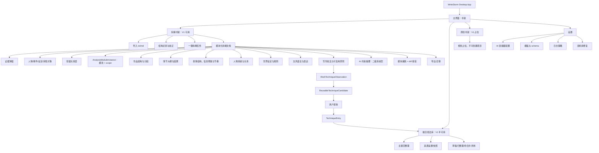
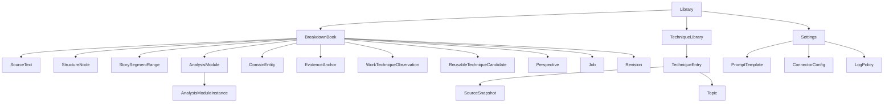

# WriteStorm 产品设计方案草案

日期：2026-07-05  
阶段：产品边界与已确认技术约束  
状态：草案；用于后续工程技术方案和实现计划

## 1. 文档目的

本文档沉淀当前已经确认的产品设计边界和关键技术约束，把核心产品对象、三大域边界、V1 范围、AI 拆解流程、证据机制、技法库规则、本地资料库策略和已确认技术方向统一成一份可引用的本地方案。

本文档记录已确认的技术方向，但不替代工程技术设计、实现计划或 UI 高保真视觉方案，也不把未来原创能力写成 V1 已验收能力。

本文档是当前产品设计事实源。

## V1 foundation recertification boundary

The recertified foundation provides the real desktop path to create/open a Library, import txt/md source material, reopen persisted Books, and start deterministic structure detection through a packaged utility process. SQLite is the fact source; copied source bytes use `source/{sourceTextId}/{originalFileName}`. This does not claim Block 8B review/freeze, Block 8C invalidation, Codex/AI execution, macOS packaging, or release makers are complete.

## 2. 产品定位

WriteStorm 是一款面向 Windows 11 和 macOS 的本地优先桌面写作者工具，不提供 Web 运行版。它帮助写作者用 AI 拆解已有小说或资料，得到可审查、可追溯、可复用的创作分析资产；随后将其中的可复用写作原则整理进融合技法库；未来再把拆解资产和技法资产用于原创小说项目。

核心价值不是“自动写小说”，而是把作品拆解、技法沉淀、原创约束组织成一个可靠的本地创作资料系统。

## 3. 目标用户

主要用户是写作者，尤其是需要长期积累参考作品、学习叙事技巧、拆解小说结构，并希望把拆解结论转化为原创项目约束的人。

用户关心：

- 一部长篇作品为什么有效。
- 哪些技法可以复用，哪些只是该作品的特征。
- 拆解结论是否有原文证据支撑。
- AI 生成的结论是否可以被审查、修正、重跑。
- 本地资料能否长期保存、迁移和修复。
- 后续原创项目能否引用这些资产而不污染来源。

## 4. 产品原则

1. 本地优先：资料库、源文件、分析结果和导出包默认保存在用户本机。
2. 审查优先：AI 生成对象默认待审查，用户确认后才进入完成资产。
3. 来源可追溯：关键结论、技法、约束和引用必须能回到来源和证据。
4. 域边界清晰：拆解书架、融合技法库、原创书架是三个不同域，不互相替代。
5. V1 聚焦闭环：第一版优先做通拆解书架闭环，不提前实现完整原创系统。
6. SQLite 主事实源：SQLite 是唯一事务性主事实源；JSON 和 Markdown 是导出、镜像或人类可读产物，不双写为主事实。
7. 可迁移可修复：资料库必须能导出、导入、重建索引和修复断链。

## 5. 三大域边界

### 5.1 拆解书架

拆解书架管理用户导入的已有作品或资料。V1 主要面向小说文本，尤其是长篇小说。

职责：

- 导入用户提供的 `.txt` / `.md` 文件。
- 识别和校正作品结构。
- 运行 AI 拆解管线。
- 生成模块化拆解文档。
- 生成待审查对象、证据、本书技法观察、可复用技法候选和 AI 约束摘要。
- 支持用户审查、编辑、重跑模块、接受或拒绝候选。
- 导出人类可读和机器可读资料包。

边界：

- 拆解书架只能产出来源资产和候选资产。
- 拆解书架不直接生成原创小说正文。
- 拆解书架不直接发布融合门禁或提示词成品。
- 拆解书中的可复用技法候选被采纳后，可以复制或引用到融合技法库，但后续技法库编辑不反写拆解书。

### 5.2 融合技法库

融合技法库管理从拆解书架中采纳出来的可复用技法条目。它不是原创书架，也不是某本原创小说。

职责：

- 接收用户从拆解书中采纳的 `ReusableTechniqueCandidate`。
- 生成独立的 `TechniqueEntry`。
- 按主题页组织技法条目。
- 编辑技法标题、摘要、标签、来源、适用范围和状态。
- 保留来源追溯和来源快照。
- 标记待合并、已整理、弃用等状态。

V1 边界：

- V1 只输出和整理 `TechniqueEntry`。
- V1 不做真正融合发布。
- V1 不生成、不发布门禁或提示词成品。
- “门禁/提示”是未来输出形态，不属于 V1 可用能力。
- 未来研究资料、论文、教材可以作为新来源类型；V1 只预留来源类型字段，不做研究资料拆解流程。

关键规则：

- 前台默认展示可复用原则。
- 来源观察和 AI 约束草稿放到二级信息中。
- 技法条目是技法库资产，不是原拆解书候选的可变镜像。
- 技法库编辑不会反写来源拆解资产。

### 5.3 原创书架

原创书架管理用户自己的原创小说项目。它和融合技法库不是同一个东西。

未来职责：

- 管理原创小说项目。
- 保存原创项目的设定、角色、结构、大纲、章节和正文。
- 引用拆解书架中已确认的抽象资产。
- 引用融合技法库中的技法条目、未来门禁或提示。
- 在项目上下文中生成或辅助生成正文。

V1 边界：

- 原创书架在 V1 是视觉上独立的占位入口。
- 原创书架 V1 不可点击、不可创建项目、不可生成正文。
- 占位不能看起来像坏掉的按钮。

未来引用规则：

- 原创项目只能引用用户确认后的抽象拆解资产。
- 原创项目不能引用草稿、低置信度内容、原始证据、原文片段或未确认 AI 资产。
- 原创项目引用来源资产时保存快照，不自动跟随来源变化。
- 原创项目对来源资产的反馈只能生成待处理建议，不能自动修改拆解书或技法库。

## 6. V1 范围

### 6.1 V1 必须完成

- 选择或创建本地资料库。
- 配置至少一个可用 AI 连接。
- 导入 `.txt` / `.md` 文件。
- 保存源文件副本到资料库。
- 填写基础元数据和类型。
- 自动识别结构。
- 用户校正卷/章节标题层级和故事段范围。
- 运行一键全量拆解。
- 显示任务进度和失败状态。
- 生成模块化拆解文档。
- 审查 AI 生成对象、证据、关系、本书技法观察和可复用技法候选。
- 编辑模块正文。
- 按模块重跑并查看 diff。
- 接受或拒绝候选版本。
- 标记书籍完成。
- 导出 Markdown-first 的人类可读包。
- 导出包含 JSON、Markdown、源文件副本和 manifest 的机器可读包。
- 资料库迁移、导入、完整性校验。
- 资料库修复和索引重建。

### 6.2 V1 可用但降级

- 融合技法库可查看和整理已采纳 `TechniqueEntry`。
- 关系层为轻量关系层，不做大型知识图谱。
- 模板编辑允许存在，但必须受到 schema、小样预览和发布流程约束。

### 6.3 V1 不做

- 原创小说项目创建。
- 原创正文生成。
- 门禁/提示词成品发布。
- 真正的多来源技法融合。
- 研究资料导入和拆解主流程。
- 网络抓书、网页搜索、书店接入。
- 非文本文件解析作为主路径。

### 6.4 Codex SDK 技术闸口

V1 AI 集成只支持 Codex SDK。Codex SDK 是重大技术风险，真实 AI 拆解实现前必须做 compatibility spike。

规则：

- V1 真实 AI 拆解只能通过 Codex SDK 接入。
- Codex SDK 必须能在 Electron main process 或 utility/worker process 侧稳定运行。
- spike 必须验证结构化输出、取消、超时、错误处理、日志、鉴权状态和打包后运行。
- 如果 Codex SDK 无法满足 V1 要求，V1 AI 能力阻塞，不自动回退到 `codex exec`、app-server、GUI app 自动化或其他供应商。
- 拆解工作台基础增量可以先不接真实 Codex SDK，只保留禁用态和未来接入口。

## 7. 核心对象模型

| 对象 | 所属域 | 说明 |
| --- | --- | --- |
| `Library` | 全局 | 用户选择的本地资料库根目录。 |
| `BreakdownBook` | 拆解书架 | 一本被导入并拆解的书或资料项目。 |
| `OriginalBook` | 原创书架 | 未来原创小说项目，V1 仅占位。 |
| `SourceText` | 拆解书架 | 导入的源文本副本和编码、hash、分段信息。 |
| `StructureNode` | 拆解书架 | 全书、卷、章节等标题层级节点；不承载可跨章节的故事段。 |
| `StorySegmentRange` | 拆解书架 | 可跨章节的故事段范围层，指向源文本区间和覆盖的章节节点，是 scope，不是标题树子节点。 |
| `AnalysisModule` | 拆解书架 | 结构分段、情节大纲与因果、叙事结构/信息释放/节奏、人物系统、世界设定、文风、技法等分析维度定义。 |
| `AnalysisModuleInstance` | 拆解书架 | `AnalysisModule + scope` 的具体分析实例，承载正文、状态、证据、重跑、diff、导出和版本。 |
| `EvidenceAnchor` | 拆解书架 | 结论对应的稳定证据锚点。 |
| `DomainEntity` | 拆解书架 | 人物、事件、地点、设定、伏笔等一等对象。 |
| `RelationLink` | 拆解书架 | 对象、证据、章节、模块、技法之间的轻量关系。 |
| `Perspective` | 拆解书架 | 跨模块专题视角，只派生和组织已有事实，不成为新事实源。 |
| `WorkTechniqueObservation` | 拆解书架 | 本书技法观察，解释该作品具体如何使用某种写法。 |
| `ReusableTechniqueCandidate` | 拆解书架 | 从本书技法观察中抽象出的可复用候选，需去除本书专有表达、角色和设定。 |
| `TechniqueEntry` | 融合技法库 | 用户采纳后进入技法库的独立技法条目。 |
| `SourceSnapshot` | 融合技法库/原创引用 | 跨域引用时保存的来源快照，源资产删除或变化后仍可只读追溯。 |
| `Topic` | 融合技法库 | 技法库主题页和整理维度。 |
| `ProblemSolutionPattern` | 拆解/原创桥接 | 桥段级引用的安全抽象形态。 |
| `PromptTemplate` | 全局/拆解 | AI 拆解模板和输出 schema 的版本化定义。 |
| `AIConstraint` | 拆解/未来原创 | AI 可用的创作约束摘要，默认待审查。 |
| `Job` | 全局 | AI 任务、导入任务、修复任务、导出任务。 |
| `Revision` | 全局 | 模块、模板、对象、条目的版本记录。 |
| `ConnectorConfig` | 全局 | AI 连接器的非敏感配置和引用。 |
| `SecretRef` | 系统 | Windows 安全存储中的凭据引用，不进入导出包。 |

## 8. 状态机

### 8.1 拆解书状态

`not_imported -> imported_pending_structure -> ready_to_analyze -> analyzing -> paused_failed -> pending_review -> pending_sync -> completed -> needs_rebuild`

说明：

- `not_imported`：导入未完成或源文件不可用。
- `imported_pending_structure`：源文件已复制，结构待确认。
- `ready_to_analyze`：结构已冻结，AI Gate 可用，用户可以启动拆解任务。
- `analyzing`：AI 管线运行中。
- `paused_failed`：任务失败、API/SDK 限制或用户暂停。
- `pending_review`：AI 结果已生成，等待用户审查。
- `pending_sync`：模块或结构改动导致局部资产待同步。
- `completed`：用户确认完成，可进入稳定资产。
- `needs_rebuild`：源文本、结构或模板版本变化导致需要重建。

### 8.2 AI 生成资产状态

所有 AI 生成对象、本书技法观察、可复用技法候选、关系链接、AI 约束默认都是待审查资产。只有用户确认后的对象才进入完成书籍、候选汇总和未来原创生成上下文。

通用状态：

`draft_ai -> pending_review -> confirmed | rejected | needs_merge | needs_rebuild`

### 8.3 分析模块实例状态

`AnalysisModuleInstance` 是用户真正审查、重跑、导出和对比的单位。

通用状态：

`not_generated -> generated_pending_review -> confirmed -> stale | needs_rebuild`

规则：

- `AnalysisModule` 只是模块定义，不能直接保存某本书某个范围的分析结果。
- 每个实例绑定一个 `scope`，scope 可以是 `book`、`volume`、`chapter` 或 `story_segment_range`。
- 模块正文、证据、结构化资产、重跑候选版本和导出状态都归实例所有。
- 结构、原文、模板或上游确认资产变化时，只标记受影响实例为 `stale` 或 `needs_rebuild`。
- 专题视角不是 `AnalysisModuleInstance`，来源实例变化后只标记可刷新。

### 8.4 本书技法观察到技法条目

流转：

`WorkTechniqueObservation generated -> user confirms/rejects -> ReusableTechniqueCandidate proposed -> user promotes/rejects -> TechniqueEntry created -> draft -> organized | pending_merge | deprecated`

规则：

- `WorkTechniqueObservation` 属于来源拆解书，用于解释该作品具体怎么写。
- `ReusableTechniqueCandidate` 由本书技法观察抽象而来，必须去除本书专有表达、角色和设定，并保留适用范围、限制和证据链。
- 只有用户确认升级后的 `ReusableTechniqueCandidate` 才能采纳进融合技法库。
- 用户采纳后生成独立 `TechniqueEntry`。
- `TechniqueEntry` 保存来源追溯和来源快照。
- 技法库编辑只影响 `TechniqueEntry`，不反写原观察或原候选。
- 拒绝的观察或候选保留在来源书的历史中，不进入技法库。

### 8.5 模板状态

`draft -> sample_passed -> published_version -> enabled -> disabled | rolled_back`

规则：

- 用户可以完整编辑提示词，但不能破坏固定输出 schema。
- 小样预览失败不能发布。
- 发布后的模板版本冻结。
- 修改已发布模板会创建新版本。
- 每本拆解书记录所用模板版本。

### 8.6 任务状态

`queued -> running -> paused -> failed -> resumable -> cancelled -> completed`

规则：

- 长任务必须可恢复。
- 失败保留已完成内容和上下文检查点。
- 取消保留已生成模块为草稿。
- 应用重启后任务状态仍可恢复。

## 9. V1 拆解主流程

1. 用户打开应用，选择或创建本地资料库。
2. 用户配置 AI 连接器。
3. 用户从拆解书架导入 `.txt` 或 `.md` 文件。
4. 应用复制源文件到资料库，并记录文件 hash、编码、大小和导入时间。
5. 用户填写基础元数据，选择主类型和子类型。
6. 应用自动识别章节、卷和候选故事段。
7. 用户校正结构。
8. 用户启动拆解任务。
9. 应用执行三段式长篇拆解管线。
10. 用户查看模块化拆解文档。
11. 用户审查对象、关系、证据、本书技法观察、可复用技法候选和 AI 约束。
12. 用户编辑模块正文或重跑指定模块。
13. 重跑结果以候选版本呈现，用户通过 diff 接受或拒绝。
14. 用户标记书籍完成。
15. 用户可导出人类可读包或机器可读包。

## 10. 长篇 AI 拆解管线

长篇小说不能一次性喂给 AI。V1 使用固定三段式管线：

### 10.1 结构识别

目标：

- 识别章节标题。
- 识别卷、篇、章等层级。
- 提出 `StorySegmentRange` 候选。
- 标记识别不确定位置。

输出：

- `StructureNode` 树。
- `StorySegmentRange` 候选。
- 结构置信度。
- 待用户校正项。

### 10.2 分层/分段分析

目标：

- 按章节、故事段、卷逐层生成剧情简介和成立机制说明。
- 识别角色、事件、设定、伏笔、冲突、状态变化、人物/关系影响、信息/局势变化、读者期待和节奏。
- 提取局部本书技法观察。
- 生成局部证据锚点。

输出：

- chapter scope summary and mechanism。
- story segment scope summary and mechanism。
- volume scope summary and mechanism。
- 局部对象和关系。
- 局部本书技法观察。

### 10.3 全书综合归纳

目标：

- 汇总全书层的结构、情节大纲与因果、人物系统、设定规则、叙事信息释放、文风语言和写作技法观察。
- 把局部观察、候选和证据归并成全书层结论。
- 生成面向人类阅读和 AI 可理解的拆解文档。

输出：

- 全书模块化文档。
- 全书对象索引。
- 全书本书技法观察和可复用技法候选。
- 可审查 AI 约束摘要。

## 11. 分析文档结构与模块合同

分析文档采用固定模板，但展示形式不是单一 Markdown。它是有排版逻辑的分模块文档：

- 每个模块使用统一审查外壳：状态、证据、重跑、diff、导出、审查入口一致。
- 模块主体布局按内容自定义：长文、表格、关系图、时间线、卡片、树状下钻都可以按模块需要使用。
- Markdown 源编辑只允许编辑模块正文。
- 证据、标签、对象链接、状态、AI 约束、本书技法观察和可复用技法候选必须通过结构化控件编辑。

### 11.1 模块资格与 scope 轴

模块不是 AI 调用、数据库表、页面或 Markdown 文件，而是用户可独立阅读、审查、编辑、重跑和导出的分析单元。

模块资格标准：

- 必须有独立审查价值。
- 必须有独立重跑价值。
- 独立证据、独立展示、独立导出是辅助判断。

V1 使用“模块 x scope 轴”模型：

- 模块是分析维度。
- `book / volume / chapter / story_segment_range` 是同一模块下的分析实例范围。
- `AnalysisModuleInstance` 是 `模块 + scope` 的实际产物。
- `story_segment_range` 是源文本范围层，可以跨章节；它不是 `StructureNode` 标题树的子节点。
- 章节摘要、故事段概要、卷级概要、全书大纲不是彼此无关的顶层模块。
- 同一模块可按 scope 下钻，也可在 book 层形成综合结论。

顶层模块在前台可以并列展示，但产品合同分三类：

- 结构/输入类：`作品结构与分段`。
- 普通分析类：`情节大纲与因果`、`叙事结构、信息释放与节奏`、`人物系统与关系`、`世界设定与规则`、`文风语言与表达`、`写作技法与可复用原则`。
- 汇总/系统类：`AI 约束摘要`，作为二级系统页，不是普通顶层分析模块。

类型差异不生成完全不同的模块表，而是作为类型关注点覆盖到稳定模块中。

### 11.2 顶层模块

V1 顶层模块锁定为：

- `作品结构与分段`
- `情节大纲与因果`
- `叙事结构、信息释放与节奏`
- `人物系统与关系`
- `世界设定与规则`
- `文风语言与表达`
- `写作技法与可复用原则`

不再作为顶层模块的内容：

- `分层概要与大纲` 并入 `情节大纲与因果`。
- `事件情节与因果` 合并为 `情节大纲与因果`。
- `情绪/读者体验` 不做顶层，作为情节成立机制维度。
- `主题母题与价值冲突` 不做顶层，并入情节和人物，也可由专题视角引用。
- `AI 约束摘要` 为二级系统页。

### 11.3 作品结构与分段

定位：前置结构层，不是普通分析模块。基础标题层级由导入解析得到；AI 主要建议 `StorySegmentRange`；用户校正故事段范围。

合同规则：

- 标题层级固定为 `book / volume / chapter`。
- `story_segment_range` 是覆盖源文本区间的范围层，可跨章节，也可落在章节内段落边界，不做字符级人工切割。
- `story_segment_range` 记录起止锚点、覆盖章节、功能标签、起止原因、核心冲突/转折和置信度。
- 章节/卷识别失败时提供“规则调整 + 手动标记”。
- 结构确认后进入冻结状态；修改需显式解冻并触发局部失效。
- 结构变更只局部失效受影响 scope 的概要、事件、证据、关系、技法和派生视角。
- AI 建议故事段时修改的是 `StorySegmentRange` 候选，不改写标题树。
- 全量拆解前必须用户确认并冻结结构。

### 11.4 情节大纲与因果

第一目标：看懂情节为什么成立。

模块名保持 `情节大纲与因果`。它仍然包含剧情简介/分层概要，但不能止步于简介。每个 `book / volume / story_segment_range / chapter` scope 先展示剧情简介，再紧跟成立机制说明。

成立机制维度固定为：

- 状态变化。
- 冲突推进。
- 人物/关系影响。
- 信息/局势变化。
- 转折/后果。
- 读者期待。
- 全书结构作用。

默认视图：

- 全书机制总览。
- 标题层级与故事段范围 scope 下钻。
- 双序时间线。
- 关键证据折叠。

合同规则：

- 情绪/阅读驱动力作为机制维度，在关键冲突链和转折处标注期待、压抑、爽点、释放、悬念等，不做独立顶层模块。
- 双序时间线服务“解释错位与因果”，保存叙事出现顺序和故事内发生顺序，允许相对/未知时间，不做完整日历系统。
- 大纲模块记录“情节如何影响人物/关系”，但完整人物弧线事实源归人物模块，通过链接引用。
- 用户可编辑模块正文，也可通过控件确认/修正关键情节点、因果和时间线标注。
- 内部 `Event` 数据模型不在产品合同层锁字段；后续由该模块输出倒推出实现。

### 11.5 人物系统与关系

第一目标：看懂人物如何成立。人物档案是模块内的角色级索引入口，不是人物模块的全部。

人物模块至少包含：

- 角色档案索引。
- 关系动力视图。
- 人物弧线/成长轨迹视图。
- 角色声音摘要。

人物档案承载：

- 基础识别。
- 外貌呈现。
- 人设标签。
- 叙事心理与动机。
- 能力/等级/状态变化。
- 人物弧线。
- 角色声音摘要。

展示原则：

- 机制优先。
- 百科折叠。
- 变化可追踪。

合同规则：

- 非主角按叙事权重分层：核心角色完整分析，重要配角中等分析，功能性角色轻量处理。
- 关系网络分析关系动力和变化，不只是关系表。
- 角色声音/对话画像归人物模块，聚焦身份化表达：口癖、语气、词汇、话语权、对不同对象的说话变化。
- 文风模块可引用角色声音，但不双写。
- 外貌只记录原文明确或可证据支持的外貌、气质、辨识特征，并区分事实描述和读者印象。
- 人设标签后续由标签库和定义提供；AI 按定义匹配并提供证据，用户确认后贴到角色档案。本轮不枚举标签库。
- 技能、等级、数值、面板默认作为角色状态/成长轨迹展示；只有原文把数值/等级/面板作为主要内容时才结构化展示，不强造数值系统。
- 能力体系规则归世界设定；角色拥有与成长归人物；具体使用造成的后果归情节；抽象写法归可复用技法候选；各模块通过关系链接引用，不重复保存同一事实源。
- 用户可编辑正文，可确认、合并、改名人物，修正关系、别名、叙事权重和对话画像。

### 11.6 叙事结构、信息释放与节奏

第一目标：看懂讲述策略。该模块不回答“发生了什么”，而回答作者怎样安排读者知道什么、什么时候知道、以什么速度推进。

核心问题：

- 读者何时知道什么。
- 哪些信息被延迟、遮蔽或误导。
- 章节如何制造钩子。
- 推进和停顿如何分布。

合同规则：

- 悬念/伏笔在叙事模块记录机制，专题视角负责串成长链。
- 节奏分析聚焦推进密度与停顿：事件密度、信息释放密度、章节钩子、场景推进/停顿、高潮前后速度变化。
- 默认先看信息释放总览，再下钻章节钩子和节奏分布。
- 用户可编辑正文，可确认/修正信息释放点、误导点、章节钩子、节奏段落和相关证据。

### 11.7 世界设定与规则

第一目标：看懂规则如何服务故事。所有类型都显示该模块；弱设定作品输出轻量摘要，不强行做隐性规则深挖。

主产物不是设定大全，而是：

- 规则实体。
- 展开时间线。
- 故事作用。
- 证据链。
- 可复用技法线索。

归属规则：

- 能力体系、规则边界、获得方式、限制和代价主归属世界设定。
- 某角色拥有和使用能力主归属人物。
- 某次能力造成的情节结果主归属情节。
- 由此抽象出的写法主归属可复用技法候选。
- 各模块通过关系链接引用，不重复保存同一事实源。

默认视图：规则实体总览，再进入展开时间线和故事作用。

用户可编辑正文，可确认/合并/修正规则实体、限制代价、展开节点、故事作用和证据。

### 11.8 文风语言与表达

第一目标：看懂表达如何产生效果。

主产物：

- 文风画像。
- 语言样本证据。
- 场景/角色声线差异。
- 节奏与修辞模式。
- 阅读效果解释。
- 可复用技法候选。

边界：

- 不输出“漂亮句子摘抄大全”。
- 不把原句当可复用资产。
- 整体语言策略归文风模块。
- 角色说话方式归人物模块。
- 具体对话造成的情节/关系变化归情节或人物。
- 抽象写法进入可复用技法候选。

默认视图：文风画像总览，再下钻样本证据、场景差异和角色声线引用。

用户可编辑正文，可确认/修正文风画像、样本证据、阅读效果解释和可复用技法候选来源。

### 11.9 写作技法与可复用原则

第一目标：形成可审查的技法资产，不直接教学，也不发布 AI 门禁。

拆解书内技法分两层：

- `WorkTechniqueObservation`：本书技法观察，解释这个作品具体怎么做。
- `ReusableTechniqueCandidate`：可复用候选，已经去除本书专有表达、角色、设定，带适用范围、限制和证据链。

合同规则：

- 本书技法观察来自全模块。
- AI 可以建议抽象，但必须用户确认后才升级为可复用候选。
- 只有 `ReusableTechniqueCandidate` 才能被采纳进入融合技法库。
- 默认先看本书技法观察，并按创作维度分类：情节、人物、设定、叙事、文风、读者驱动等。
- 可复用候选跟原本书观察放一起，显示抽象版、适用限制、来源和升级状态。
- 用户可编辑正文，可确认/修改本书观察，升级/拒绝/修正可复用候选和适用限制。
- 不在拆解书里直接编辑融合技法库条目。

### 11.10 专题视角

专题视角不是新事实源，而是组合已有模块产物、关系链接、证据和必要派生综合形成的阅读/审查/导出视角。

V1 内置五个视角：

1. `伏笔 / 悬念 / 回收链`
   - 第一目标：列出伏笔清单。
   - 状态：待回收、已回收、部分回收、误导性回收、疑似未回收、用户排除。
   - 支持多源多回收，引用已有模块节点和证据。
   - 可生成链路总结，但只作为派生视图。

2. `人物关系动力 / 身份互动`
   - 主目标：看关系如何变化。
   - 副产物：识别身份互动写法线索。
   - 关系事实归人物模块，视角串变化链，技巧线索进入技法模块。
   - 链路项包含身份/权力差异、触发事件、互动方式、关系变化、证据和技法线索。

3. `设定展开 / 规则兑现`
   - 追踪关键设定或规则从暗示/引入，到解释、验证、挑战、扩展，再兑现为故事后果的链条。
   - 状态：暗示、引入、解释、验证、挑战、扩展、兑现、违例/代价、遗留问题。

4. `节奏 / 情绪 / 阅读驱动力`
   - 第一目标：解释为什么好读。
   - 主要组合情节、叙事、文风，必要时引用人物/设定。
   - 可产出技法线索，但必须进入技法模块统一审查。

5. `可复用技法来源视角`
   - 第一目标：追溯抽象来源。
   - 技法模块保存观察和候选，来源视角只负责跨模块追溯证据、限制和抽象路径。

专题视角来源变化后标记可刷新，用户手动刷新派生总结；不自动刷新、不每次打开现算。

### 11.11 证据、审查、重跑与 diff

证据是可信度硬闸，不是装饰引用。

证据规则：

- 关键结论、候选、关系变化没有证据，不能进入确认资产或可复用候选。
- 证据不足的结论显示为“待证据补全”，不能确认或进入技法/原创上下文。
- 证据密度按复杂度动态：事实/定位结论 1 条；解释性结论 2-3 条；跨模块/技法/关系变化 3-5 条。
- 证据状态：有效、待确认、待重建、断链、被用户排除、低相关。
- 用户可确认、排除、替换证据，跳转原文，并要求补证据。
- 关键结论和可复用候选确认前，关键证据必须有效。
- 用户确认的是证据相关性和结论解释是否接受，不能用主观接受替代缺失证据。
- 标记书籍完成前，所有用户可见 AI 资产必须处理；后台中间缓存不算。

重跑规则：

- 重跑生成候选版本，用户看 diff 后接受。
- 重跑参考源文、当前模块、用户编辑、已确认对象/关系/证据和旧结果。
- diff 比较模块正文变化、对象/关系/证据/候选状态变化，并突出下游影响。
- 接受候选版本时，用户已确认/手改资产默认保留；候选对这些资产的改动需逐项确认。
- 重跑范围为 `模块 + scope`，可选 `book / volume / story_segment_range / chapter`。
- 专题视角不是事实源，不按普通模块重跑；来源变化后标记可刷新。
- 重跑失败时当前版本不受影响，已生成的候选部分保留为失败草稿，可继续或丢弃。

### 11.12 类型模板

首批内置类型：

- 日轻校园。
- 异世界。
- 古代玄幻。
- 现代幻想。
- 都市恋爱。
- 无限流。

规则：

- 用户选择主类型和子类型。
- 主类型决定基础模板冲突时的优先级。
- 子类型添加独特关注点。
- 类型库包含内置类型和用户自定义类型。
- 自定义类型从内置模板复制后编辑。

## 12. 证据锚点

证据是可信度硬闸，不是装饰引用。关键结论、候选和关系变化没有证据，不能进入确认资产或可复用候选。

证据密度按结论复杂度动态处理：

- 事实/定位结论：至少 1 条证据。
- 解释性结论：默认 2-3 条代表证据。
- 跨模块结论、可复用技法候选、关系变化：默认 3-5 条代表证据。

`EvidenceAnchor` 字段：

- source text ID。
- book ID。
- source range ID。
- covered structure node IDs。
- story segment range ID，可为空。
- character start offset。
- character end offset。
- excerpt text。
- excerpt hash。
- generating module ID。
- prompt template version。
- generation time。
- anchor status。

证据状态：

- 有效。
- 待确认。
- 待重建。
- 断链。
- 被用户排除。
- 低相关。

展示规则：

- 默认折叠证据引用。
- 点击证据打开可拖动、非阻塞原文弹窗。
- 点击其他证据时更新同一个弹窗内容。
- 切换模块时关闭弹窗。
- 用户可确认、排除、替换证据，跳转原文，并要求补证据。
- 被排除或低相关证据不能支撑确认资产。

失效规则：

- 原文变化后，旧证据保留摘录和旧位置，但标记需要重建。
- 章节拆分、合并、故事段范围调整、卷边界变化会局部标记受影响摘要、证据、模块结论和 AI 约束为失效。
- 证据不足的结论显示为“待证据补全”，不能确认或进入技法/原创上下文。

## 13. 关系层

V1 使用轻量关系层，不做完整知识图谱。

一等对象：

- 人物。
- 事件。
- 地点。
- 设定。
- 关系。
- 伏笔。
- 技法。
- 证据。
- 结论。
- AI 约束。

对象生命周期：

- AI 创建后进入待确认。
- 用户可确认、拒绝、合并、拆分、改名、设置别名。
- 合并必须保留来源记录。
- 拆分必须重新分配相关链接。

核心关系类型：

- cites evidence。
- appears in chapter。
- covered by story segment range。
- associated character。
- triggers event。
- depends on setting。
- manifests technique。
- supports conclusion。
- derives constraint。

关系要求：

- 从技法能回到来源证据。
- 从人物能回到相关章节和事件。
- 从结论能回到支持证据。
- 从 AI 约束能回到来源技法或结论。

### 13.1 事实源归属

跨模块可以引用、提出修正建议和生成派生视角，但不能双写同一事实。

| 事实类型 | 主事实源 | 其他模块只能做什么 | 冲突处理 |
| --- | --- | --- | --- |
| 标题层级、章节边界 | `StructureNode` | 引用 scope | 生成结构待处理建议 |
| 故事段范围 | `StorySegmentRange` | 引用 range scope | 生成范围调整建议 |
| 事件、因果、状态变化 | `情节大纲与因果` | 引用事件或影响 | 生成情节待处理建议 |
| 人物身份、别名、关系、弧线 | `人物系统与关系` | 引用人物和关系 | 生成合并/拆分/改名建议 |
| 信息释放、误导、伏笔机制 | `叙事结构、信息释放与节奏` | 引用机制点 | 生成叙事待处理建议 |
| 设定规则、限制、代价 | `世界设定与规则` | 引用规则实体 | 生成设定待处理建议 |
| 整体文风、语言策略 | `文风语言与表达` | 引用样本和风格结论 | 生成文风待处理建议 |
| 本书技法观察、可复用候选 | `写作技法与可复用原则` | 引用技法资产 | 生成技法待处理建议 |
| AI 可用约束摘要 | `AI 约束摘要` | 引用约束 | 生成约束待处理建议 |

### 13.2 失效传播规则

| 变化 | 直接失效 | 待复核 | 不自动改写 |
| --- | --- | --- | --- |
| 源文本 hash 变化 | 相关 `EvidenceAnchor`、受影响 `AnalysisModuleInstance` | 关系、候选、AI 约束 | 用户已确认资产 |
| 标题层级变更 | 受影响 scope 实例、证据定位、导出索引 | 专题视角、关系链接 | 未覆盖范围的实例 |
| `StorySegmentRange` 调整 | 该 range 的模块实例和证据 | 情节、叙事、技法、专题视角 | 标题树 |
| 人物合并/拆分/改名 | 人物索引和相关关系视图 | 情节影响、技法线索、AI 约束 | 来源证据摘录 |
| 模板发布新版本 | 后续新任务 | 用户选择重跑的旧实例 | 已发布旧模板版本 |
| Markdown 正文编辑 | 对应实例正文 revision | 相关结构化资产 | JSON 结构字段 |

## 14. 技法观察、可复用候选与融合技法库

### 14.1 拆解书内两层技法资产

拆解书内技法资产分两层：

1. `WorkTechniqueObservation`：本书技法观察，解释该作品具体怎么做。
2. `ReusableTechniqueCandidate`：可复用候选，已经去除本书专有表达、角色和设定，带适用范围、限制和证据链。

规则：

- 本书技法观察来自情节、叙事、人物、设定、文风等全模块。
- AI 可以建议抽象，但必须用户确认后才升级为 `ReusableTechniqueCandidate`。
- 只有 `ReusableTechniqueCandidate` 才能被采纳进入融合技法库。
- 技法模块按创作维度组织可复用原则：情节、人物、设定、叙事、文风、读者驱动等。
- 可复用候选跟原本书观察放一起，显示抽象版、适用限制、来源和升级状态。
- 技法前台默认展示可复用原则；来源作品观察、证据链和 AI 约束草稿进入二级信息。
- 只有还没有形成可复用候选的条目，才以“待抽象的本书观察”状态展示。
- 拆解书内不直接编辑融合技法库条目。

### 14.2 V1 技法条目

`TechniqueEntry` 是融合技法库 V1 的基本单位。它只能由用户采纳的 `ReusableTechniqueCandidate` 生成。

字段建议：

- id。
- title。
- reusable principle。
- topic。
- tags。
- source type。
- source observations。
- source reusable candidate。
- source snapshot。
- evidence summary。
- applicable genre。
- applicable scope。
- limitations。
- status。
- created time。
- updated time。

V1 能力：

- 查看技法条目。
- 按主题页组织。
- 编辑标题、摘要、标签、来源和适用范围。
- 标记状态。
- 查看来源快照。
- 标记待合并。

V1 不做：

- 自动融合多个技法条目。
- 发布门禁。
- 生成提示词成品。
- 直接进入原创正文生成。

## 15. 桥段级引用安全对象

桥段级引用不能保存角色、专有设定或原文表达。需要转换成 `ProblemSolutionPattern`。

允许字段：

- problem type。
- setup conditions。
- solution mechanism。
- rhythm position。
- emotional function。
- applicable limits。

禁止字段：

- 具体角色名。
- 专有设定名。
- 原文句子。
- 可复刻的桥段表达。
- 大段情节复述。

目的：

- 允许原创项目学习“问题-解法机制”。
- 降低复刻原作品表达和设定的风险。
- 保留可审查、可解释、可迁移的抽象模式。

## 16. 原创书架未来引用规则

原创项目未来可以引用两类资产：

1. 拆解书架中已确认的抽象资产。
2. 融合技法库中的技法条目、未来门禁或提示。

引用必须保存：

- source asset ID。
- source version。
- snapshot。
- reference purpose。
- reference time。
- source status at reference time。

引用目的必填：

- structure。
- character function。
- event solution。
- rhythm。
- emotion。
- style。
- trope/problem-solution。
- setting abstraction。
- writing principle。

快照策略：

- 来源更新时，只在原创项目引用列表显示可刷新。
- 不自动更新原创项目上下文。
- 用户可查看 diff 后手动刷新。
- 来源删除或归档后，快照仍只读有效，但标记断链。
- 断链快照不能刷新，不能作为新引用来源。

原创项目模型：

- 原创项目有独立对象模型。
- 它只共享部分模块抽象和映射。
- 不能把拆解文档强行当成原创工程。
- 原创框架可以根据项目裁剪、扩展和重组。

## 17. 资产 ID 与导入冲突

规则：

- 资产 ID 在当前资料库内唯一。
- 导出包保留 ID。
- 导入时如发生 ID 冲突，生成新 ID。
- 冲突导入时保留 `originalSourceId`。
- 引用快照即使源资产删除也继续只读有效。

删除规则：

- 删除来源资产不会删除已有快照。
- 删除来源资产会使相关引用标记为断链。
- 断链引用不能刷新。
- 断链引用可以继续作为历史上下文阅读，但不能再被当作活跃来源。

## 18. 本地资料库与存储

资料库由用户选择本地文件夹。应用必须允许用户理解和迁移数据，而不是把资料锁死在不可见数据库里。

建议结构：

```text
library-root/
  manifest.json
  writestorm.sqlite
  source/
    breakdown-books/
      {book-id}/
        original.txt
  exports/
    {export-id}/
  logs/
  cache/
  mirrors/
    markdown/
    json/
```

主事实源：

- `writestorm.sqlite` 是唯一事务性主事实源，保存结构化对象、状态、关系、证据、版本、索引、任务和审查状态。
- JSON 只作为机器可读导出、调试镜像或迁移包内容，由 SQLite 派生。
- Markdown 只作为模块正文阅读、正文编辑视图、导出包或镜像，由 SQLite 派生并回写受控正文字段。
- Markdown 可编辑范围限于 `AnalysisModuleInstance` 正文字段。
- 结构字段、证据、标签、对象链接、状态、AI 约束必须经结构化控件写入 SQLite。
- Markdown 正文编辑会创建 `Revision`，并把对应 `AnalysisModuleInstance` 标记为正文已改。
- 如果正文编辑涉及已确认结论、对象、关系或候选，相关结构化资产显示“需复核”，但不自动改写。
- 导出时必须能区分“正文已编辑但结构化资产未复核”的模块。

## 19. 导出、迁移与修复

### 19.1 导出

人类可读导出：

- Markdown-first。
- 可包含模块文档、摘要、技法条目和证据引用。

机器可读导出：

- manifest。
- JSON 数据。
- Markdown 文档。
- 源文件副本。
- 文件 hash。
- 对象版本。
- 模板版本。
- schema 版本。

导出不包含：

- Windows 安全存储里的凭据。
- 完整敏感日志，除非用户显式选择。
- 账号 token 或密钥。

### 19.2 迁移

迁移包必须能在新机器导入。新机器需要重新授权 AI 连接器。

导入检查：

- manifest 是否存在。
- hash 是否匹配。
- schema 是否兼容。
- ID 是否冲突。
- 源文件是否完整。
- 模块文档是否完整。
- 证据锚点是否可定位。
- 引用快照是否完整。

### 19.3 修复与重建索引

资料库必须提供完整健康检查：

- manifest。
- book directories。
- JSON 文件。
- Markdown 文件。
- source text。
- evidence anchors。
- task checkpoints。
- relation links。
- orphan objects。
- duplicate IDs。
- broken snapshots。

修复能力：

- 重建索引。
- 标记孤儿对象。
- 标记断链引用。
- 重算 hash。
- 恢复可恢复任务。
- 将无法自动修复的问题列为人工处理项。

## 20. AI 配置、日志与运行限制

### 20.1 AI 配置

V1 至少需要一个 active AI config。

配置显示：

- 当前连接器。
- 使用模型。
- 会发送哪些内容类型。
- 是否发送原文。
- 当前日志策略。
- 运行限制和失败处理策略。
- 失败原因和最近调用。

### 20.2 凭据

凭据保存在 Windows 安全存储中。资料库只保存非敏感连接器引用。

导出包不包含凭据。迁移到新机器后需要重新授权。

### 20.3 日志

日志策略必须清晰：

- 是否保存完整 prompt。
- 是否保存完整 response。
- 是否包含原文。
- 是否默认导出。
- 如何手动清理。

默认规则：

- 日志保存在本地。
- 默认不进入迁移导出包。
- 用户显式选择后才可导出日志。

### 20.4 V1 运行限制

V1 不要求运行前成本、token 或耗时估算，也不设置预算确认门禁。

运行中规则：

- 如果 Codex SDK 返回实际用量或运行统计，应用可以记录并在日志或任务详情中展示。
- 如果 SDK 不返回用量，状态显示为 unknown，不伪造估算。
- API/SDK 硬限制、超时、取消或运行异常触发时，保存已完成 checkpoint 并进入 paused/failed/resumable。

## 21. 导入校验

V1 仅支持 `.txt` 和 `.md`。

必须处理：

- 编码识别失败。
- 空文件。
- 超大文件。
- 重复导入。
- 章节标题识别失败。
- 可能不是小说的误导入。
- 文件 hash 冲突。
- 源文件复制失败。

处理方式：

- 明确提示原因。
- 给出可修复路径。
- 允许用户手动指定编码。
- 允许用户手动校正结构。
- 允许用户取消导入。

## 22. 产品结构图

范围：V1 产品结构，用于技术方案和后续界面设计对齐。此图不表示最终视觉布局。



## 23. 产品表面清单

| 入口 | 当前对象 | 可看 | 可做 | 写入/流向 | 守卫状态 |
| --- | --- | --- | --- | --- | --- |
| 主界面书架 | 资料库 | 拆解书、原创占位、技法入口 | 进入可用区域 | 无 | 资料库已选择 |
| 拆解书架 | `BreakdownBook` 列表 | 已导入书、状态、进度 | 导入、打开、继续任务 | 写入 book/job/index | 文件校验 |
| 结构校正 | `StructureNode` + `StorySegmentRange` | 卷、章节、故事段范围 | 调整标题层级、校正故事段范围 | 写入 structure/range；影响失效规则 | 源文件存在 |
| 拆解任务 | `Job` | 进度、checkpoint、失败原因 | 启动、暂停、恢复、取消 | 写入 job/modules/evidence | 结构已冻结且 AI Gate 可用 |
| 拆解文档 | `AnalysisModuleInstance` | 模块正文、证据、对象、关系、专题视角 | 编辑正文、审查、重跑 | 写入 JSON/Markdown/revision | 模板版本绑定 |
| 证据弹窗 | `EvidenceAnchor` | 原文摘录、位置、状态 | 查看证据 | 不直接写入 | anchor 有效或待重建 |
| 本书技法观察 | `WorkTechniqueObservation` | 本书技法表现、来源模块、证据 | 确认、拒绝、抽象为候选 | 可升级为 `ReusableTechniqueCandidate` | 用户确认 |
| 可复用技法候选 | `ReusableTechniqueCandidate` | 抽象原则、适用限制、来源观察、证据链 | 采纳、拒绝、修正 | 采纳后创建 `TechniqueEntry` | 关键证据有效 |
| 融合技法库 | `TechniqueEntry` | 条目、主题、来源 | 编辑、整理、标记状态 | 写入 technique library | V1 不发布门禁 |
| 原创书架 | 无 | 占位 | 无 | 无 | V1 不可用 |
| 设置 | 全局配置 | AI、模板、日志、修复 | 配置、验证、清理、修复 | 写入 config/index | 凭据走安全存储 |

## 24. 信息架构



## 25. V1 验收口径

### 25.1 拆解闭环验收

给定一本 `.txt` 或 `.md` 小说：

- 用户可以导入。
- 应用复制源文件并建立资料库记录。
- 应用能识别结构，用户能校正。
- 用户能启动任务。
- 任务失败或中断后可恢复。
- 生成模块化拆解文档。
- `作品结构与分段` 支持 `book / volume / chapter` 标题树和可跨章节的 `story_segment_range` 范围层。
- `AnalysisModuleInstance` 支持按 `模块 + scope` 审查、重跑、diff 和导出。
- `情节大纲与因果` 支持按 `book / volume / story_segment_range / chapter` 下钻；每层先展示剧情简介，再展示成立机制。
- `人物系统与关系` 支持角色档案索引、关系动力视图、人物弧线/成长轨迹视图和角色声音摘要。
- `世界设定与规则` 支持规则实体总览、展开时间线、故事作用和证据链。
- `文风语言与表达` 支持文风画像、语言样本证据、场景/角色声线差异和阅读效果解释。
- `写作技法与可复用原则` 支持本书技法观察和可复用技法候选两层资产。
- V1 内置专题视角支持伏笔/悬念/回收链、人物关系动力/身份互动、设定展开/规则兑现、节奏/情绪/阅读驱动力、可复用技法来源追溯。
- 关键结论、候选和关系变化带证据锚点；证据不足时不能进入确认资产或可复用候选。
- 用户能审查 AI 生成对象、本书技法观察、可复用技法候选、关系和证据。
- 用户能编辑模块正文。
- 用户能按 `模块 + scope` 重跑，并通过正文和结构化资产 diff 接受或拒绝候选版本。
- 用户能标记完成；完成前所有用户可见 AI 资产必须确认、拒绝、排除或合并。
- 用户能导出可读 Markdown 和机器可读包。

### 25.2 技法库半可用验收

给定一本已完成拆解书：

- 用户能看到按创作维度组织的 `WorkTechniqueObservation`。
- 用户能把本书技法观察确认升级为 `ReusableTechniqueCandidate`。
- 用户采纳可复用候选后生成独立 `TechniqueEntry`。
- 技法条目能在融合技法库中查看。
- 技法条目前台默认显示可复用原则。
- 来源观察、证据链、适用限制和 AI 约束草稿处于二级信息。
- 用户能编辑技法条目。
- 用户能查看来源追溯和快照。
- 技法库不会反写拆解书中的本书观察或可复用候选。
- V1 不出现可发布门禁或提示词成品的假入口。

### 25.3 原创书架占位验收

- 主界面能明显看出原创书架和拆解书架不是同一域。
- 原创书架 V1 不能创建项目。
- 原创书架占位不表现为坏掉的可点击入口。
- 不把融合技法库误展示成原创书架的一部分。

### 25.4 资料库验收

- 用户能选择本地资料库。
- 资料库内容可导出。
- 导出包含 manifest、JSON、Markdown、源文件副本和 hash。
- 导出不包含凭据。
- 导入冲突时生成新 ID 并保留 `originalSourceId`。
- 资料库健康检查能发现缺失文件、断链、孤儿对象和 hash 不匹配。

## 26. 明确非目标

- 不做网页抓取小说。
- 不做在线书库。
- 不把 AI 结论默认当事实。
- 不让 Markdown 自由编辑破坏结构化主事实源。
- 不把原创书架和技法库合并。
- 不在 V1 生成原创正文。
- 不在 V1 发布门禁或提示词成品。
- 不在 V1 做研究资料主流程。
- 不依赖无法迁移的隐藏数据库作为唯一事实源。

## 27. 主要风险

### 27.1 Codex SDK 集成风险

风险：Codex SDK 无法在 Electron main process 或 utility/worker process 中满足结构化输出、取消、日志、鉴权、错误处理或打包后运行要求。

处置：

- 真实 AI 拆解实现前做 Codex SDK compatibility spike。
- 不允许用 `codex exec`、app-server、GUI app 自动化或其他供应商偷换 V1 AI 验收。
- spike 失败则 V1 AI 能力阻塞；非 AI 的拆解工作台基础能力仍可继续实施。

### 27.2 长篇耗时和失败恢复风险

风险：长篇小说耗时长、上下文大、失败率高，且 V1 不提供运行前成本或耗时估算。

处置：

- 三段式管线。
- job checkpoint。
- 局部恢复。

### 27.3 结构化数据与 Markdown 同步风险

风险：用户自由改 Markdown 或导出镜像导致 SQLite 主事实源与阅读产物不一致。

处置：

- Markdown 只编辑模块正文，并通过受控服务回写 SQLite。
- 结构字段和关系通过结构化控件写入 SQLite。
- 模块正文和结构字段边界必须在 UI 上明确。
- 正文编辑创建 revision，并触发相关结构化资产的复核提示。
- 未复核的正文改动在导出包中保留状态标记。

### 27.4 技法复刻风险

风险：桥段级技法引用可能复刻原作品表达。

处置：

- 使用 `ProblemSolutionPattern`。
- 禁止保存角色名、设定名和原句。
- 保留适用限制。

### 27.5 域边界漂移风险

风险：后续开发把原创书架、拆解书架和融合技法库混成一个对象。

处置：

- 三域独立对象模型。
- 只通过确认资产、快照和引用关系跨域。
- 原创项目不反写来源资产。

## 28. 工程实施前必须验证的问题

1. Codex SDK 是否能在 Electron main process 或 utility/worker process 中满足 V1 spike 验收。
2. SQLite schema、migration、备份、恢复和资料库版本策略如何设计。
3. Electron main、preload、renderer、utility/worker process 的权限和 IPC 边界如何落地。
4. SQLite 与 Markdown/JSON 派生产物的编辑、导出、镜像和冲突策略如何落到控件。
5. 长篇任务队列和 checkpoint 粒度如何设计。
6. 大文件导入、hash、编码识别和结构识别预处理的性能基线是多少。
7. V1 UI 视觉语言是否需要独立高保真设计阶段。

## 29. AI 可读摘要

```yaml
product: WriteStorm
stage: product-design-with-technical-constraints
date: 2026-07-05
platform:
  targets:
    - Windows 11
    - macOS
  excludes:
    - web_runtime
technical_decisions:
  desktop_stack:
    - Electron
    - React
    - TypeScript
  primary_store: SQLite
  derived_artifacts:
    - JSON exports
    - Markdown exports
    - optional mirrors
  ai_v1:
    provider_surface: Codex SDK
    fallback_policy: block_v1_ai_if_sdk_fails
domains:
  breakdown_shelf:
    v1_status: usable
    owns:
      - BreakdownBook
      - SourceText
      - StructureNode
      - StorySegmentRange
      - AnalysisModule
      - AnalysisModuleInstance
      - EvidenceAnchor
      - DomainEntity
      - RelationLink
      - WorkTechniqueObservation
      - ReusableTechniqueCandidate
      - Perspective
    outputs:
      - confirmed_analysis_assets
      - reviewed_work_technique_observations
      - reviewed_reusable_technique_candidates
      - export_packages
    cannot:
      - generate_original_novel
      - publish_gate_or_prompt
  technique_library:
    v1_status: half_usable
    owns:
      - TechniqueEntry
    unit: TechniqueEntry
    v1_can:
      - organize_entries
      - edit_entries
      - view_source_snapshot
      - mark_pending_merge
    v1_cannot:
      - fuse_entries
      - publish_gate
      - publish_prompt
  original_shelf:
    v1_status: placeholder_only
    future_owns:
      - OriginalBook
    future_can_reference:
      - confirmed_abstract_breakdown_assets
      - technique_entries
      - future_gates_or_prompts
    cannot:
      - write_back_to_breakdown_shelf
      - write_back_to_technique_library
v1_required:
  - import_txt_md
  - structure_correction
  - frozen_book_volume_chapter_structure_tree
  - confirmed_story_segment_range_scope
  - ai_gate_ready
  - long_form_ai_pipeline
  - modular_analysis_doc
  - plot_outline_and_causality_module
  - character_system_and_relationship_module
  - narrative_information_and_rhythm_module
  - world_rules_module
  - style_language_module
  - technique_observation_and_reusable_candidate_module
  - built_in_perspectives
  - evidence_anchors
  - review_gate
  - module_rerun_with_diff
  - export_and_migration
  - library_repair
hard_rules:
  ai_assets_default_pending_review: true
  json_is_source_of_truth: true
  markdown_edits_module_body_only: true
  markdown_body_edits_create_revision_and_review_state: true
  modules_use_scope_axis: true
  story_segment_is_range_scope_not_structure_child: true
  work_technique_observation_before_reusable_candidate: true
  reusable_candidate_required_for_technique_entry: true
  evidence_is_confirmation_gate: true
  source_references_use_snapshot: true
  credentials_excluded_from_export: true
  v1_no_original_generation: true
  v1_no_gate_prompt_publication: true
```
