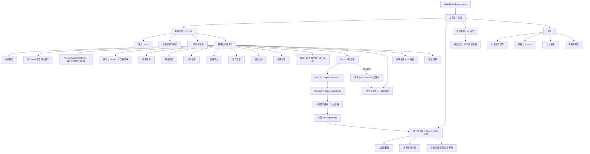

# WriteStorm 产品设计方案草案

日期：2026-07-05
阶段：产品边界与已确认技术约束
状态：草案；用于后续工程技术方案和实现计划

## 1. 文档目的

本文档沉淀当前已经确认的产品设计边界和关键技术约束，把核心产品对象、三大域边界、V1 范围、AI 拆解流程、证据机制、技法库规则、本地资料库策略和已确认技术方向统一成一份可引用的本地方案。

本文档记录已确认的产品方向，但不替代工程技术设计、实现计划或 UI 高保真视觉方案，也不把未来原创能力写成 V1 已验收能力。当前已实现能力与真实入口验收以
`docs/engineering/CONTEXT.md` 和 `docs/product/FLOWS.md` 为准。

本文档是当前产品设计事实源。

Block 14 的当前模块本体、领域语义与系统生产质量方向以 D122–D132、
`docs/engineering/V1-BLOCK-14-G0-CROSS-EXAMINATION-RECORD.md` 和
`docs/engineering/V1-BLOCK-14-INFERENCE-GOVERNANCE-PLAN.md` 为准。故事情节的 Q1–Q47
完整裁决另见
`docs/engineering/V1-BLOCK-14-STORY-PLOT-CROSS-EXAMINATION-RECORD.md`；实现基线影响见
`docs/engineering/V1-BLOCK-14-G1-IMPLEMENTATION-BASELINE-IMPACT-ASSESSMENT.md`；REV3.2 系统生产
质量门禁的唯一详细记录是
`docs/engineering/V1-BLOCK-14-SYSTEM-PRODUCTION-QUALITY-GATE.md`，当前状态为
`BLOCK14_NOT_FROZEN / QUALITY_UNPROVEN`。本文档中被明确标记为
旧实现基线的内容只用于 14-G1 影响识别，不得覆盖获批本体或作为 deep Schema、Prompt
和实现依据。

## Historical V1 foundation recertification boundary

The recertified foundation provided the real desktop path to create/open a Library, import txt/md source
material, reopen persisted Books, and start deterministic structure detection through a packaged utility
process. Later Block 8 work subsequently added structure review/correction/freeze/unfreeze plus its
synchronous DB-only invalidation seam. Current user-visible behavior is maintained in `FLOWS.md`; this
historical evidence boundary does not claim a real downstream rerun, production Codex/AI analysis,
macOS packaging, release makers, or release readiness. SQLite is the fact source; copied source bytes
use `source/{sourceTextId}/{originalFileName}`.

## 2. 产品定位

WriteStorm 是一款面向 Windows 11 和 macOS 的本地优先桌面写作者工具，不提供 Web 运行版。它帮助写作者用 AI 拆解已有小说或资料，得到可审查、可追溯、可复用的创作分析资产；随后将其中的可复用写作原则整理进融合技法库；未来再把拆解资产和技法资产用于原创小说项目。

核心价值不是“自动写小说”，而是把作品拆解、技法沉淀、原创约束组织成一个可靠的本地创作资料系统。

## 3. 目标用户

主要用户是写作者，尤其是需要长期积累参考作品、学习叙事技巧、拆解小说结构，并希望把拆解结论转化为原创项目约束的人。

用户关心：

- 一部长篇作品为什么有效。
- 哪些技法可以复用，哪些只是该作品的特征。
- 拆解结论是否有原文证据支撑。
- AI 生成的结论是否可以被审查、修正、重跑。
- 本地资料能否长期保存、迁移和修复。
- 后续原创项目能否引用这些资产而不污染来源。

## 4. 产品原则

1. 本地优先：资料库、源文件、分析结果和导出包默认保存在用户本机。
2. 审查优先：AI 生成内容默认无权威下游资格；是否必须人工审查按风险和消费者规则决定，只有满足对应审查与来源资格的资产才能进入该消费者的权威集合。
3. 来源可追溯：关键结论、技法、约束和引用必须能回到来源和证据。
4. 域边界清晰：拆解书架、融合技法库、原创书架是三个不同域，不互相替代。
5. V1 聚焦闭环：第一版优先做通拆解书架闭环，不提前实现完整原创系统。
6. SQLite 主事实源：SQLite 是唯一事务性主事实源；JSON 和 Markdown 是导出、镜像或人类可读产物，不双写为主事实。
7. 可迁移可修复：资料库必须能导出、导入、重建索引和修复断链。

## 5. 三大域边界

### 5.1 拆解书架

拆解书架管理用户导入的已有作品或资料。V1 主要面向小说文本，尤其是长篇小说。

职责：

- 导入用户提供的 `.txt` / `.md` 文件。
- 识别和校正作品结构。
- 运行 AI 拆解管线。
- 生成模块化拆解文档。
- 生成待审查对象、证据、本书技法观察、可复用技法候选和 AI 约束摘要。
- 支持用户审查、编辑、重跑模块、接受或拒绝候选。
- 导出人类可读和机器可读资料包。

边界：

- 拆解书架只能产出来源资产和候选资产。
- 拆解书架不直接生成原创小说正文。
- 拆解书架不直接发布融合门禁或提示词成品。
- 拆解书中的可复用技法候选是未来采纳流程的唯一合法来源；candidate owner 与原子采纳事务尚未准入，当前不能生成 `TechniqueEntry`。

### 5.2 融合技法库

融合技法库的目标态是管理从拆解书架中采纳出来的可复用技法条目。它不是原创书架，也不是某本原创小说。

后续完成生产者、身份和原子采纳事务准入后的目标职责：

- 接收用户从拆解书中采纳的 `ReusableTechniqueCandidate`。
- 生成独立的 `TechniqueEntry`。
- 按主题页组织技法条目。
- 编辑技法标题、摘要、标签、来源、适用范围和状态。
- 保留来源追溯和来源快照。
- 标记待合并、已整理、弃用等状态。

Block 12 当前交付边界：

- Technique Library 是真实空态；只说明未来条目来自已采纳候选。
- “Adopt confirmed candidate” 原生禁用，原因是 candidate owner 与原子采纳事务尚未准入。
- 只展示 `SourceSnapshot` 契约位置和只读、不反写来源域的语义，不虚构条目实例。
- 不提供真实编辑表单、创建入口、repository、service、IPC 或 Technique production tables。
- TechniqueEntry 持久化仍 blocked/deferred，后续 Block 16 必须重新通过生产者与事务准入。
- 当前不做真正融合发布，也不生成、不发布门禁或提示词成品。
- “门禁/提示”是未来输出形态，不属于 V1 可用能力。
- 未来研究资料、论文、教材可以作为新来源类型；V1 只预留来源类型字段，不做研究资料拆解流程。

关键规则：

- 未来前台默认展示可复用原则，来源观察和 AI 约束草稿放到二级信息中。
- 未来技法条目必须是独立资产，不是原拆解书候选的可变镜像。
- `SourceSnapshot` 永远只读；未来技法库编辑也不得反写来源观察、候选、证据或来源拆解书。

### 5.3 原创书架

原创书架管理用户自己的原创小说项目。它和融合技法库不是同一个东西。

未来职责：

- 管理原创小说项目。
- 保存原创项目的设定、角色、结构、大纲、章节和正文。
- 引用拆解书架中已确认的抽象资产。
- 引用融合技法库中的技法条目、未来门禁或提示。
- 在项目上下文中生成或辅助生成正文。

V1 边界：

- 原创书架在 V1 是视觉上独立的占位入口。
- 原创书架 V1 不可点击、不可创建项目、不可生成正文。
- 占位不能看起来像坏掉的按钮。

未来引用规则：

- 原创项目只能引用用户确认后的抽象拆解资产。
- 原创项目不能引用草稿、低置信度内容、原始证据、原文片段或未确认 AI 资产。
- 原创项目引用来源资产时保存快照，不自动跟随来源变化。
- 原创项目对来源资产的反馈只能生成待处理建议，不能自动修改拆解书或技法库。

## 6. V1 范围

### 6.1 V1 必须完成

- 选择或创建本地资料库。
- 配置至少一个可用 AI 连接。
- 导入 `.txt` / `.md` 文件。
- 保存源文件副本到资料库。
- 填写基础元数据和类型。
- 自动识别结构。
- 用户校正卷/章节标题层级和故事段范围。
- 运行一键全量拆解。
- 显示任务进度和失败状态。
- 生成模块化拆解文档。
- 审查 AI 生成对象、证据、关系、本书技法观察和可复用技法候选。
- 编辑模块正文。
- 按模块重跑并查看 diff。
- 接受或拒绝候选版本。
- 标记书籍完成。
- 导出 Markdown-first 的人类可读包。
- 导出包含 JSON、Markdown、源文件副本和 manifest 的机器可读包。
- 资料库迁移、导入、完整性校验。
- 资料库修复和索引重建。

### 6.2 V1 可用但降级

- 融合技法库当前只有真实空态、禁用采纳入口和只读来源边界；查看、整理或编辑真实 `TechniqueEntry` 仍待 Block 16 准入。
- 关系层为轻量关系层，不做大型知识图谱。
- 模板当前只有 registry、样例闸和发布状态机壳；真实编辑、预览和发布必须在 Block 14/17 完成内容、所有权与运行时准入。

### 6.3 V1 不做

- 原创小说项目创建。
- 原创正文生成。
- 门禁/提示词成品发布。
- 真正的多来源技法融合。
- 研究资料导入和拆解主流程。
- 网络抓书、网页搜索、书店接入。
- 非文本文件解析作为主路径。

### 6.4 Codex SDK 技术闸口

V1 AI 集成只支持 Codex SDK。Codex SDK 是重大技术风险，真实 AI 拆解实现前必须做 compatibility spike。

规则：

- V1 真实 AI 拆解只能通过 Codex SDK 接入。
- Codex SDK 必须能在 Electron main process 或 utility/worker process 侧稳定运行。
- spike 必须验证结构化输出、取消、超时、错误处理、日志、鉴权状态和打包后运行。
- 如果 Codex SDK 无法满足 V1 要求，V1 AI 能力阻塞，不自动回退到 `codex exec`、app-server、GUI app 自动化或其他供应商。
- 拆解工作台基础增量可以先不接真实 Codex SDK，只保留禁用态和未来接入口。

### 6.5 AI 长期多供应商方向

WriteStorm 的长期多供应商方向包括独立接入 OpenAI/Codex、Claude、DeepSeek 等 AI 能力。V1 仍然只准入 Codex SDK；这是首版范围和验收决策，不是永久供应商独占。

规则：

- 用户或任务必须显式选择 provider；一个 provider 失败后不得静默切换到另一个 provider。
- 每个 provider 必须分别通过供应链、鉴权、隐私、结构化输出、取消、错误映射、打包和兼容性 gate。
- Claude、DeepSeek 和其他 provider 不得作为本次 Codex 6A feasibility 的 fallback，也不在本任务安装、实现或调用。
- 正式 AI Job/Pipeline 必须通过 provider-neutral execution port 和独立 adapter 隔离供应商语义；Codex SDK 类型、CLI/JSONL、Git/cwd 和进程细节不得成为公共产品模型。
- 本次 6A 只验证 Codex-specific feasibility，不提前实现 provider registry、其他 provider adapter、动态插件系统或真实 AI 工作流。

## 7. 核心对象模型

| 对象 | 所属域 | 说明 |
| --- | --- | --- |
| `Library` | 全局 | 用户选择的本地资料库根目录。 |
| `BreakdownBook` | 拆解书架 | 一本被导入并拆解的书或资料项目。 |
| `OriginalBook` | 原创书架 | 未来原创小说项目，V1 仅占位。 |
| `SourceText` | 拆解书架 | 导入的源文本副本和编码、hash、分段信息。 |
| `CoverageSliceRevision` | 拆解书架 | 绑定 SourceText edition 与 coverage-plan revision 的无缺口 core 覆盖记录；可带重叠 halo，但不拥有文学事实，也不是 AI 调用边界。 |
| `StructureNode` | 拆解书架 | 全书、卷、章节等标题层级节点；不承载可跨章节的故事段。 |
| `StorySegmentRange` | 拆解书架 | 可跨章节的故事段范围层，指向源文本区间和覆盖的章节节点，是 scope，不是标题树子节点。 |
| `AnalysisModule` | 拆解书架 | 14-G0 批准七个核心模块：故事情节、叙述调度、人物塑造、关系动力、世界设定、语言文体、主题意蕴。旧 canonical keys、顺序和 seed 仅为待 14-G1 处理的兼容基线。 |
| `AnalysisModuleInstance` | 拆解书架 | `AnalysisModule + scope` 的运行、输入版本、状态、引用清单和 scope 综合容器；它不因 scope 不同而复制 canonical 事实。 |
| `EvidenceAnchor` | 拆解书架 | 结论对应的稳定证据锚点。 |
| `InferenceReviewRecord` | 拆解书架 | 重要解释的有限审查记录，将有证据的观察、竞争解释、当前判断、反证/推翻条件、适用范围和下游依赖收束为一个可修订单元。它首先是语义与产品契约，不表示每条事实都要成为独立数据库对象。 |
| `DomainEntity` | 拆解书架 | 人物、事件、地点、设定、伏笔等一等对象。 |
| `RelationLink` | 拆解书架 | 对象、证据、章节、模块、技法之间的轻量关系。 |
| `Perspective` | 拆解书架 | 跨模块专题视角，只派生和组织已有事实，不成为新事实源。 |
| `WorkTechniqueObservation` | Block 16 技法域 | 本书技法观察，引用七模块的稳定来源结论并解释该作品具体如何使用某种写法。 |
| `ReusableTechniqueCandidate` | Block 16 技法域 | 从本书技法观察中抽象出的可复用候选，需去除本书专有表达、角色和设定。 |
| `TechniqueEntry` | 融合技法库 | 未来由已采纳候选生成的独立条目；Block 12 无生产对象或持久化。 |
| `SourceSnapshot` | 融合技法库/原创引用 | 未来跨域引用时保存的不可变只读来源快照；Block 12 只展示契约，不展示虚构实例。 |
| `Topic` | 融合技法库 | 技法库主题页和整理维度。 |
| `ProblemSolutionPattern` | 拆解/原创桥接 | 桥段级引用的安全抽象形态。 |
| `PromptTemplate` | 全局/拆解 | AI 拆解模板和输出 schema 的版本化定义。 |
| `AIConstraint` | 约束治理/未来原创 | 模块外约束治理域拥有的正式约束，包含候选来源、适用范围、强度、冲突、审查和版本；七个核心模块不直接拥有。 |
| `Job` | 全局 | AI 任务、导入任务、修复任务、导出任务。 |
| `Revision` | 全局 | 模块、模板、对象、条目的版本记录。 |
| `ConnectorConfig` | 全局 | AI 连接器的非敏感配置和引用。 |
| `SecretRef` | 系统 | Windows 安全存储中的凭据引用，不进入导出包。 |

## 8. 状态机

### 8.1 拆解书状态

`not_imported -> imported_pending_structure -> ready_to_analyze -> analyzing -> paused_failed -> pending_review -> pending_sync -> completed -> needs_rebuild`

说明：

- `not_imported`：导入未完成或源文件不可用。
- `imported_pending_structure`：源文件已复制，结构待确认。
- `ready_to_analyze`：结构已冻结，AI Gate 可用，用户可以启动拆解任务。
- `analyzing`：AI 管线运行中。
- `paused_failed`：任务失败、API/SDK 限制或用户暂停。
- `pending_review`：AI 结果已生成，等待用户审查。
- `pending_sync`：模块或结构改动导致局部资产待同步。
- `completed`：现有兼容状态；后续完成产品语义必须投影为 `AnalysisCoverageComplete` 与 `AuthorityReviewComplete`，不能用一个状态统一放行所有下游。
- `needs_rebuild`：源文本、结构或模板版本变化导致需要重建。

### 8.2 AI 生成资产状态

AI 生成内容默认不进入权威下游集合。结构化不等于全部必审：具体必审范围由风险分层和真实消费者资格决定；未审资产不得自动获得权威资格，`unresolved` 也不得因覆盖处置完成而自动供下游使用。

通用状态：

`draft_ai -> pending_review -> confirmed | rejected | needs_merge | needs_rebuild`

### 8.3 分析模块实例状态

`AnalysisModuleInstance` 是模块加 Scope 的运行、正文修订、状态投影、引用与综合容器，也是用户发起审查、重跑、导出和对比的外部边界；内部资产仍由各自领域所有者管理。

通用状态：

`not_generated -> generated_pending_review -> confirmed -> stale | needs_rebuild`

规则：

- `AnalysisModule` 只是模块定义，不能直接保存某本书某个范围的分析结果。
- 每个实例绑定一个 `scope`，scope 可以是 `book`、`volume`、`chapter` 或 `story_segment_range`。
- 模块正文 revision 和真正的 Scope 综合归实例；证据与 canonical 结构化资产不因 Scope 不同复制，实例只保存稳定引用。
- 结构、原文、模板或上游资产变化时，优先定位受影响结论、必要原文范围和真实依赖闭包，再投影实例级 `stale` 或 `needs_rebuild` 状态。
- 专题视角不是 `AnalysisModuleInstance`，来源实例变化后只标记可刷新。

### 8.4 本书技法观察到技法条目

目标流转（Block 16 重新准入生产者和原子采纳事务后）：

`WorkTechniqueObservation generated -> user confirms/rejects -> ReusableTechniqueCandidate proposed -> user promotes/rejects -> TechniqueEntry created -> draft -> organized | pending_merge | deprecated`

规则：

- `WorkTechniqueObservation` 属于来源拆解书，用于解释该作品具体怎么写。
- `ReusableTechniqueCandidate` 由本书技法观察抽象而来，必须去除本书专有表达、角色和设定，并保留适用范围、限制和证据链。
- 只有用户确认升级后的 `ReusableTechniqueCandidate` 才有资格进入未来采纳事务。
- 当前 candidate owner 与原子采纳事务尚未准入，不能生成独立 `TechniqueEntry`。
- `TechniqueEntry` 保存来源追溯和来源快照。
- 技法库编辑只影响 `TechniqueEntry`，不反写原观察或原候选。
- 拒绝的观察或候选保留在来源书的历史中，不进入技法库。

### 8.5 模板状态

模板生命周期不是单状态轴，至少分为四个独立概念：

- 样例闸：`sampleGateStatus = not_run | blocked | failed | passed`。
- 不可变发布事实：版本以 `publishedAt = null` 表示 draft，以非空 `publishedAt` 表示曾发布。
- Registry 当前指针与启停：`publishedVersionId` 和 `activationStatus = enabled | disabled`。
- 回滚是操作，不是版本状态；它只能把当前指针恢复到符合约束的历史已发布版本。

规则：

- Block 12 不提供真实模板正文或编辑器，只冻结 registry 与版本状态壳。
- 小样预览失败不能发布。
- 发布后的模板版本冻结。
- 修改已发布模板会创建新版本。
- 每本拆解书记录所用模板版本。

### 8.6 任务状态

`queued -> running -> paused -> failed -> resumable -> cancelled -> completed`

规则：

- 长任务必须可恢复。
- 失败保留已完成内容和上下文检查点。
- 取消保留已生成模块为草稿。
- 应用重启后任务状态仍可恢复。

## 9. V1 拆解主流程

1. 用户打开应用，选择或创建本地资料库。
2. 用户配置 AI 连接器。
3. 用户从拆解书架导入 `.txt` 或 `.md` 文件。
4. 应用复制源文件到资料库，并记录文件 hash、编码、大小和导入时间。
5. 用户可在导入时或导入后主动选择一个 MainType 和零至三个有序 ContentFocus；应用不自动分析或归类，正式分析前缺少 MainType 时硬阻断。
6. 应用自动识别章节、卷和候选故事段。
7. 用户校正结构。
8. 用户启动拆解任务。
9. 应用执行长篇拆解管线；结构准备、候选发现、身份消歧、领域分析和跨模块综合是就绪波次，不预先锁定 AI 调用次数。
10. 用户查看模块化拆解文档。
11. 用户分别审查七模块资产、证据与推断记录、Block 16 技法资产和约束治理域资产。
12. 用户编辑模块正文或重跑指定模块。
13. 重跑结果以候选版本呈现，用户通过 diff 接受或拒绝。
14. 用户标记书籍完成。
15. 用户可导出人类可读包或机器可读包。

## 10. 长篇 AI 拆解管线

长篇小说需要分范围读取与综合。以下三段描述产品就绪阶段，不规定 Block 17 必须使用三次
调用、一次联合扫描或固定全文重读策略。

### 10.1 结构识别

目标：

- 识别章节标题。
- 识别卷、篇、章等层级。
- 提出 `StorySegmentRange` 候选。
- 标记识别不确定位置。

输出：

- `StructureNode` 树。
- `StorySegmentRange` 候选。
- 结构置信度。
- 待用户校正项。

### 10.2 共享覆盖、候选路由与分层分析

目标：

- 使用绑定 source edition 与 coverage-plan revision 的 `CoverageSliceRevision` core 无缺口、无重叠地证明正文覆盖；实际扫描可携带重叠 halo。
- Chapter、Story segment、Volume 和 Book 只提供结构投影、上下文与综合范围，不固定 AI 调用边界；Block 17 决定合批、拆分和上下文复用。
- 识别人物与集体身份、故事事件、关系互动、世界实体与规则说法、叙述呈现、语言观察及意义候选。
- 把候选路由到唯一领域所有者，完成必要的身份合并、拆分和消歧。
- 只把达到正式资产资格的候选升级为领域资产；潜在技法只能提交给 Block 16。
- 生成可定位证据锚点，并保留尚不能确认的证据不足或 unresolved 结果。

输出：

- chapter、story segment 和 volume 的运行记录、引用清单及合法 scope 综合。
- 跨 scope 使用稳定身份的领域资产和结论，不按运行范围复制事实。
- 路由到对应所有者的候选及待消歧项。
- 提交给 Block 16 的技法发现候选；核心模块不直接创建正式技法资产。

### 10.3 全书综合归纳

目标：

- 在冻结结构范围上综合故事情节、叙述调度、人物塑造、关系动力、世界设定、语言文体和主题意蕴。
- 引用跨 scope 稳定资产形成全书层综合，不复制局部事实或静默覆盖已确认资产。
- 生成面向人类阅读和 AI 可理解的拆解文档。

输出：

- 全书模块化文档。
- 全书对象索引。
- 七模块全书综合，以及 checked-empty、not-applicable、insufficient-evidence 或 unresolved 的诚实处置。
- Block 16 独立生成并审查的技法观察和可复用候选。
- 约束治理域拥有、`AI 约束摘要`只读展示的有效约束。

## 11. 分析文档结构与模块合同

分析文档采用固定模板，但展示形式不是单一 Markdown。它是有排版逻辑的分模块文档：

- 每个模块使用统一审查外壳：状态、证据、重跑、diff、导出、审查入口一致。
- 模块主体布局按内容自定义：长文、表格、关系图、时间线、卡片、树状下钻都可以按模块需要使用。
- Markdown 源编辑只允许编辑模块正文。
- 证据、领域资产、对象链接、推断记录和审查状态通过所属域的结构化控件处理。
- 正式技法资产和 AIConstraint 分别进入 Block 16 与模块外约束治理域；核心模块页面只能引用或提交候选。

### 11.1 模块资格与 scope 轴

模块不是 AI 调用、数据库表、页面或 Markdown 文件，而是用户可独立阅读、审查、编辑、重跑和导出的分析单元。

模块资格标准：

- 必须有独立审查价值。
- 必须有独立重跑价值。
- 独立证据、独立展示、独立导出是辅助判断。

V1 使用“模块所有权 + scope 运行/展示/综合轴”模型：

- 模块是领域事实和解释的唯一所有者。
- `book / volume / chapter / story_segment_range` 是结构投影、上下文、用户请求、展示和综合范围，不是事实文件夹或默认 AI 调用边界。
- `AnalysisModuleInstance` 是 `模块 + scope` 的运行记录、输入版本、状态、资产引用清单和本范围综合容器。
- 同一事件、人物、关系、规则或语言观察跨 scope 保持一个稳定身份；高层 scope 只能引用它形成新的综合解释。
- `story_segment_range` 是源文本范围层，可以跨章节；它不是 `StructureNode` 标题树的子节点。
- 章节摘要、故事段概要、卷级概要、全书大纲不是彼此无关的顶层模块。
- 大 scope 运行不得静默覆盖小 scope 已确认事实，只能引用、提出修订或创建真正的高层综合。

产品合同分三层：

- 前置结构/scope 层：Book、卷、章、故事段和文本范围；不是 AnalysisModule。
- 核心分析层：故事情节、叙述调度、人物塑造、关系动力、世界设定、语言文体、主题意蕴。
- 下游域：Block 15 专题视角、Block 16 技法资产、模块外约束治理及只读 `AI 约束摘要`；均不是额外核心模块。

类型差异不生成完全不同的模块表，而是作为类型关注点覆盖到稳定模块中。

14-G0 已冻结上述本体与单写者方向。D131 关闭端点与所有权窄补丁后的故事情节领域语义，但生产配置保持开放；当前
领域语义进度为 `1 / 7`。其他六模块及所有共享命题、Evidence、审查、历史和物理 payload
Schema 仍未冻结。现行 shared contract、migration seed 和工作台壳仍是旧模块兼容基线；
14-G1 已完成影响盘点，但未取得实现准入。

### 11.2 顶层模块

14-G0 批准：

- `故事情节`
- `叙述调度`
- `人物塑造`
- `关系动力`
- `世界设定`
- `语言文体`
- `主题意蕴`

卷、章、故事段和文本范围退出模块本体，只作为前置结构与 scope。专题视角、技法提炼、约束治理和 `AI 约束摘要` 均为下游域；摘要只是只读组合页。

#### 11.2.1 故事情节（D131：领域语义关闭、生产配置开放）

故事情节回答“故事世界中发生了哪些值得追踪的变化，这些变化怎样连接并形成持续发展”。
规范资产为 `StoryEvent`、`EventRelation`、`Plotline` 和 `PlotlineRelationClaim`；
Scope 投影非权威，`StandardStoryRecap` 是有来源的派生回顾。人物、关系和世界持续状态仍由
对应模块单写。

当前状态为 `DOMAIN_SEMANTICS_CLOSED / PRODUCTION_CONFIGURATION_OPEN`。完整准入、
EventRelation端点、Plotline生命周期、Recap空结果、Evidence、ContentFocus、fixture及
Q1–Q47争议台账只以
`docs/engineering/V1-BLOCK-14-STORY-PLOT-CROSS-EXAMINATION-RECORD.md` 为准；本产品设计不
维护第二套详细规范，也不授权Schema、Prompt或实现。

以下 11.3–11.9 只保留旧实现基线到 D124/D131 权威的撤销映射，不再保留可能被误用为活动
规格的旧关注面。其他六模块仍需逐项审查“看什么、怎样分析、证据与反证规则”，在此之前
不得派发共享 deep Schema、Prompt 或 Block 17 实现。

### 11.3 旧：作品结构与分段（已撤销模块身份）

已撤销其 AnalysisModule 身份。活动合同只保留 Book、卷、章、故事段、标题、顺序、包含关系、
原文范围、edition 和冻结状态。结构层不保存分段理由、功能标签、冲突、转折、聚焦或意义
解释；这些结论由七模块各自单写。

### 11.4 旧：情节大纲与因果（已撤销）

旧模块已由 `故事情节` 与 `叙述调度` 的明确边界覆盖。D131 将故事情节收束为
StoryEvent、EventRelation、Plotline 和 PlotlineRelationClaim 四类规范资产，以及非权威
Scope 投影和派生 StandardStoryRecap；叙述调度单写文本呈现顺序与信息操作。剧情简介和
分层概要只是引用底层资产的综合表达，不是第二事实源。

### 11.5 旧：人物系统与关系（已拆分）

旧合并模块已拆为 `人物塑造` 与 `关系动力`。人物塑造单写人物身份、个人目标、阶段状态和
人物发展解释；关系动力单写有方向、可不对称的关系事实、状态、阶段及多方动力。口癖、
词汇、句法和语气模式由语言文体单写，人物页只能组合展示并保存人物塑造解释。

### 11.6 旧：叙事结构、信息释放与节奏（已收窄）

旧模块更名并收窄为 `叙述调度`。它只拥有叙述呈现实例、叙述者/层级/聚焦、呈现顺序、
时长/频率、场景/概述/停顿/省略和信息的明示、遮蔽、延迟、重复、修正与揭示。情节推进
归故事情节，语言节奏归语言文体，真实读者效果需要接受数据。

### 11.7 旧：世界设定与规则（已扩展）

旧模块扩展为 `世界设定`。它分析空间、物质条件、资源、阶层、职业、制度、文化环境、
世界实体及公共规则，不局限于超自然硬规则，也不为每个名词建立百科。人物对规则的信念
归人物塑造；事件中的使用与结果归故事情节；象征意义归主题意蕴。

### 11.8 旧：文风语言与表达（已更名）

旧模块更名为 `语言文体`，直接对象是有语言、版本和原作/译本身份的当前文本。它单写
语言形式、局部观察、模式与 scope 综合；统计只用于发现线索，比较性判断必须说明基准，
单次突出表达只能支持局部观察。正式技法资产归 Block 16，真实读者效果需要接受数据。

### 11.9 旧：写作技法与可复用原则（已移出核心模块）

已退出核心 AnalysisModule。Block 16 是正式技法观察、跨模块/跨 Scope 机制综合、可复用
候选、正面/负面/条件性评价及采纳流程的唯一所有者。七模块只提供稳定来源结论或提交
技法发现候选；尚未提炼技法不得阻止基础分析完成。

### 11.10 专题视角

专题视角不是新事实源，而是组合已有模块产物、关系链接、证据和必要派生综合形成的阅读/审查/导出视角。

V1 内置五个视角：

1. `伏笔 / 悬念 / 回收链`
   - 第一目标：列出伏笔清单。
   - 状态：待回收、已回收、部分回收、误导性回收、疑似未回收、用户排除。
   - 支持多源多回收，引用已有模块节点和证据。
   - 可生成链路总结，但只作为派生视图。

2. `人物关系动力 / 身份互动`
   - 主目标：看关系如何变化。
   - 副产物：识别身份互动写法线索。
   - 关系事实归关系动力，人物身份与个人状态归人物塑造；视角只串联变化链，技巧线索提交 Block 16。
   - 链路项包含身份/权力差异、触发事件、互动方式、关系变化、证据和技法线索。

3. `设定展开 / 规则兑现`
   - 追踪关键设定或规则从暗示/引入，到解释、验证、挑战、扩展，再兑现为故事后果的链条。
   - 状态：暗示、引入、解释、验证、挑战、扩展、兑现、违例/代价、遗留问题。

4. `节奏 / 情绪 / 阅读驱动力`
   - 第一目标：组合故事情节、叙述调度、人物塑造、世界设定和语言文体的来源结论，展示可能的阅读机制。
   - 没有接受数据时只能展示效果假说，不能确认真实读者一定产生某种感受。
   - 可产出技法线索，但必须进入 Block 16 统一审查。

5. `可复用技法来源视角`
   - 第一目标：追溯抽象来源。
   - Block 16 保存观察和候选，来源视角只负责跨模块追溯证据、限制和抽象路径。

专题视角来源变化后标记可刷新，用户手动刷新派生总结；不自动刷新、不每次打开现算。

### 11.11 证据、审查、重跑与 diff

证据是可信度硬闸，不是装饰引用。

证据规则：

- 关键结论、候选和关系变化必须保留可定位证据；缺少必要证据时不能成为 confirmed 权威来源。
- 证据不足的结论必须明确表示为 insufficient-evidence、needs-evidence 或 unresolved，不能冒充确认结果。
- 证据充分性按主张类型、覆盖范围、竞争解释和反证判断；14-G0 不冻结通用数量配额，不能以凑够固定摘录条数代替支持链审查。
- EvidenceAnchor 的具体状态词表留待后续证据与状态机质询；至少必须区分有效、断链、版本/范围不匹配和用户排除。
- 用户可确认、排除、替换证据，跳转原文，并要求补证据。
- 关键结论和可复用候选确认前，关键证据必须有效。
- 用户确认的是证据相关性和结论解释是否接受，不能用主观接受替代缺失证据。
- 运行完成、有限关注面已交代、单条结论确认和特定下游可用性必须分开显示。
- 基础分析完成只要求冻结结构范围和七模块诚实交代有限关注面；Block 15 视角、Block 16 技法和 AI 约束摘要不得反向阻止基础分析完成。
- 书级进度使用两个语义：`AnalysisCoverageComplete` 表示必要正文覆盖和有限关注面已诚实处置；`AuthorityReviewComplete` 表示当前权威审查集合已明确处置。两者都不能一键授予专题、技法、约束、导出或原创消费者资格。
- 结构化不等于全部必审；未审资产不得自动进入权威集合。延期只有在该项明确排除出当前权威集合、且依赖它的消费者保持 `partial` 或 `blocked` 时才不阻塞相应里程碑。

重跑规则：

- 重跑生成候选版本或修订建议，用户看 diff 后接受；大 Scope 运行不能静默覆盖小 Scope 的已确认事实。
- 重跑参考源文、当前模块、用户编辑、已确认资产/关系/证据和旧结果。
- diff 比较正文、资产引用、候选和审查状态变化，并按真实依赖突出下游影响。
- 接受候选版本时，用户已确认或手改资产默认保留；改变事实含义必须回到唯一所有者处理。
- `模块 + scope` 是用户请求和最大容器边界；内部最小重跑目标是受影响结论、必要原文范围及真实依赖闭包。只有证据表明局部覆盖不足时才扩大到 Scope、模块或全书。
- 专题视角不是事实源，不按普通模块重跑；来源变化后标记可刷新。
- 重跑失败时当前版本不受影响，已生成的候选部分保留为失败草稿，可继续或丢弃。

### 11.12 类型模板

TypeLibraryVersion 1 提供七个 MainType：

- **日轻校园**：以校园、社团为主要舞台，用轻小说式节奏展开青春日常、恋爱喜剧、群像互动或校园中的异常事件，注重人与人之间关系的描写。
- **日轻异界**：以 DQ 为蓝本的日式西幻世界舞台，围绕异世界探索、异能或金手指规则、伙伴关系和冒险展开。
- **现代都市**：以现实社会为舞台，围绕主角拥有的金手指，重点描写人际关系互动或事业经营。
- **现代幻想**：在现代社会结构中引入修行、怪异、异能、神秘组织等超常体系，重点表现日常现实与隐秘力量世界的交织。
- **古代幻想**：以中国古代或古典东方世界为基础，通过王朝、宗门、修行、神魔和江湖秩序推动人物成长、权力斗争与世界变局。
- **西式幻想**：以欧洲中世纪式文明为主要审美基础，围绕帝国、宗教、种族、魔法、战争及文明兴衰展开宏观幻想叙事。
- **诸天无限**：主角团在不同世界冒险探索，重点展示不同世界的独特规则与生态，以及对它们的摸索理解。

TypeLibraryVersion 1 同时提供七个正交 ContentFocus：

- **恋爱炒股**：男主和多个女主之间的情感纠葛，女主塑造和不同女主互动是重中之重。
- **英雄史诗**：主角和众人抗争命运、经历轰轰烈烈的战争，重点关注众人在高压环境下的成长和挣扎。
- **能力规则**：关注不同角色的技能效果、限制、成长、情报博弈，以及能力碰撞产生的变化。
- **种田运营**：关注如何运用领先知识和剧情资源建设、经营并推动社会发展。
- **群像**：主角是主要视角但不独占剧情分量，重点看不同角色成长及其故事交织。
- **事业**：关注如何运用眼光、金手指等个人资源发展事业。
- **冒险探索**：在不断变化的新环境中探索情报、应对压力和突破难关，并获得与风险相称的回报。

规则：

- MainType 与 ContentFocus 是正交组合，不是父子继承或主类型/子类型树。
- 一本 Book 可保存零或一个 MainType，以及零至三个有序 ContentFocus；顺位只确定 Overlay 组合顺序，不产生覆盖权限。
- 类型完全由用户主动选择，应用不自动分析或归类。导入时可以不选，但正式分析前必须有一个 MainType，否则返回 `missing_main_type`。
- MainType 只表达未来方法论 Base 的产品意图，ContentFocus 只表达未来受约束 Overlay 的产品意图；模块体系已由 D124 冻结，具体模块方法论、composition conflict 与 Prompt 内容仍由 Block 14 后续门禁定义。
- Prompt 内容超预算时采用确定性优先级 B：最小 Base 覆盖 -> 证据/身份/所有权/coverage-risk 所需正确性触发 -> 用户排序的本书特别关注 -> 有序 ContentFocus Overlay -> 可选文学深挖。必需内容应拆批或显式延期，不能静默丢弃。
- 程序化安全与契约校验不占 Prompt 内容预算，但仍计入总运行成本、延迟和失败率硬上限。
- Book 保存稳定 definition/version identity 和 TypeLibraryVersion；应用不静默默认、升级、rebase 或改写旧书。
- 用户重申的目标规则是：MainType/ContentFocus 一经确认永久冻结。Block 12 当前仍允许后续 Book metadata CAS 编辑，与该规则冲突；确认时点、既有 Book 兼容和入口迁移必须单独裁决，本轮不静默关闭现有路径。
- 自定义类型入口在 Block 12 保持禁用。未来用户可以选择已有类型作为基础模本，但身份、持久化、版本、样例和发布生命周期必须另行准入。

### 11.13 有限通用推断治理

WriteStorm 不把“模型能给出解释”视为解释已经可信。模型继续负责开放性的文学理解；产品负责让重要解释显露依据、适用范围、不确定性、竞争解释、反证和可纠正关系。

通用语义链分为四层：

1. **文本事实**：文本明确陈述、叙述或可定位发生的内容。若叙述可靠性本身有争议，事实只能表述为“文本/叙述者声称 X”，不能把 X 静默提升为作品世界的客观真相。
2. **可观察现象**：对行为重复、措辞分布、事件顺序、信息安排、形式特征等的有证据描述；它说明“看到了什么”，不直接解释原因。
3. **解释性判断**：对人物动机、需求、冲突性质、情节因果、叙事作用、阅读效果或技法机制等作出的解释。
4. **派生结论**：综合事实、观察和一个或多个解释形成的模块结论或跨模块可引用判断。

这四层首先是语义层级，不默认对应四类表、四套实体或每条事实一个节点。普通事实和阅读性分析可以留在模块 payload 或 Markdown 正文中。只有满足以下任一条件的解释，才必须进入结构化的 `InferenceReviewRecord`：

- 需要用户确认或纠正；
- 会被其他模块引用；
- 会进入专题视角、技法观察/候选、AI 约束或导出；
- 会影响书籍完成门禁、重跑范围或下游失效；
- 属于人物心理/需求、非显式因果、叙事效果、文风效果、技法原理等不能从单一文本事实直接读出的关键判断。

一个重要推断审查记录必须足以回答：

- 正在解释什么问题，以及结论适用的 `scope`、人物阶段或文本范围；
- 模型观察到了哪些事实或现象，它们分别映射到哪些 `EvidenceAnchor`；
- 存在哪些会实质改变结论或下游结果的重要候选解释；
- 当前判断是直接事实、强推断、弱推断还是待验证假设；
- 当前为何暂时采用某个解释，或为何保持 `unresolved`；
- 存在哪些反证、证据冲突或证据不足；
- 什么新证据会降低、推翻或重新打开当前判断；
- 哪些结构化资产依赖该观察、解释或结论。

不要求穷举一切理论上可能的解释。只有在现有证据下仍合理、且选择它会改变结论或下游处理的“重要替代解释”需要保留。证据无法区分多个重要解释时，必须保留多解或 `unresolved`，不能为了输出完整而强行选择唯一答案。

推断强度和用户审查是两个不同轴：

- 推断强度描述文本支持程度，不等于用户是否看过。
- 用户可以确认“这是一个被正确记录的待验证假设”，但该确认不能把假设升级为事实。
- 内部 `confirmed + analysis_inference` 在前台和导出中显示为“受支持解释”或“已接受推断”，
  不显示为“已确认事实”。
- 存在未解决的强反证时，解释不能成为已确定结论；它只能保留为假设、竞争解释或进入 `needs_evidence`。
- 低置信、证据不足、证据冲突和存在反证必须可区分，不能压成一个模糊分数。
- 不使用看似精确但没有校准依据的小数置信度替代证据审查。

下表记录逐模块领域语义状态。故事情节领域语义已经关闭、生产配置仍开放；其余六项仍只是后续拷打入口，不是冻结
payload：

| 获批模块 | 方法论状态 | 关注面/权威 |
| --- | --- | --- |
| 故事情节 | `DOMAIN_SEMANTICS_CLOSED / PRODUCTION_CONFIGURATION_OPEN` | D131 及故事情节 Q1–Q47 记录 |
| 叙述调度 | `OPEN` | 叙述呈现实例、叙述者/层级/聚焦、顺序/时长/频率、信息操作 |
| 人物塑造 | `OPEN` | 稳定身份、阶段目标/知识/信念/动机、选择和发展解释 |
| 关系动力 | `OPEN` | 轻量关系事实、方向性/不对称状态、阶段及多方动力 |
| 世界设定 | `OPEN` | 环境、资源、制度、规范、公共能力/规则定义、限制和例外 |
| 语言文体 | `OPEN` | 当前文本版本中的语言形式、局部观察、模式、变化与 scope 综合 |
| 主题意蕴 | `OPEN` | 主题问题、象征/意义模式、价值冲突、叙事立场和竞争解释 |

用户可以纠正证据、事实/观察、候选解释、当前判断和派生结论。每次纠正保留旧 revision 和纠正原因，不静默改写历史。修改全局推断方法不属于单条资产编辑，必须创建新的 `MethodologyVersion`。

Markdown 正文继续承担阅读和表达作用，但不是结构化推断事实的唯一载体。正文编辑不会自动反向生成或修改观察、解释或结论；需要进入下游的变化必须通过结构化审查动作明确提交。

AI 执行时采用分层组合，而不是把全部方法论、所有模块规则和所有示例塞入每次调用：

1. 短且版本化的通用推断协议；
2. D124 批准的模块身份，加上 Block 14 后续批准的当前 scope 关注面；
3. 当前输出 Schema；
4. 少量与当前失败风险直接相关的示例。

机制或效果假说也遵守单写者：单一领域机制由拥有该机制的模块写入；主题、象征和价值结构
的意义解释归主题意蕴；跨域机制被综合成正式技法时，其效果假说归 Block 16。同一效果
命题不得在多个模块和技法资产中复制；暂时无法确定所有者的跨域命题只能保留为带明确
领域所有者的统一推断审查记录或 unresolved。真实读者接受结果必须另有可定位接受数据。

产品只保存简短的审计理由、证据映射、重要替代解释和推翻条件，不请求或保存模型私有的逐步思维链。

### 11.14 本书特别关注

当前产品缺少首次正式分析前的书级自定义问题入口。MainType、ContentFocus、系统 scope 关注卡、分析后正文编辑和专题视角备注均不能替代它。

规划能力允许用户为一本 Book 填写零至多个自然语言问题，并可选目标模块与 scope。它只追加问题，不改变七模块本体、事实准入、所有权、证据规则、标准故事回顾或 Schema。每项问题允许得到结果、检查后未发现、不适用、证据不足或 `unresolved`，不能为了回答而强造结论。

问题集随首次正式分析配置冻结并进入 Book 分析配置快照。Block 14 冻结追加、路由资格和证据边界；Block 17 将有效问题组合进既有运行，不默认另跑一套全书 AI；Block 18 负责未来持久化、依赖、历史和选择性重跑影响。本节只登记产品与交接边界，不准入 DTO、表、IPC、UI 或运行实现。

## 12. 证据锚点

证据是可信度硬闸，不是装饰引用。关键结论、候选和关系变化没有证据，不能进入确认资产或可复用候选。

证据充分性取决于主张类型、适用范围、覆盖程度、来源独立性、竞争解释和反证。不能用固定
摘录条数代替支持链审查，也不能因为凑够数量就确认结论。具体密度和准入规则留待七模块
深度方法论及通用证据质询。

`EvidenceAnchor` 的逻辑身份至少需要支持源文本与 `sourceTextEdition`、可定位原文范围、
摘录身份/hash、必要的结构/Scope 引用、来源/生成身份、revision 和健康状态。语言文体
证据还必须能区分分析语言及原作、正式译本、改写本或 AI 释义身份。最终字段名、可选性和
Schema 尚未冻结。

状态机的正式词表尚未冻结，但必须能区分有效、断链、edition/range 不匹配、用户排除和
等待重建；证据相关性、审查状态和结论支持强度不得压成同一个状态。

展示规则：

- 默认折叠证据引用。
- 点击证据打开可拖动、非阻塞原文弹窗。
- 点击其他证据时更新同一个弹窗内容。
- 切换模块时关闭弹窗。
- 用户可确认、排除、替换证据，跳转原文，并要求补证据。
- 被排除或低相关证据不能支撑确认资产。
- `EvidenceAnchor` 只证明文本位置和摘录身份，不自动证明解释成立。解释必须显式说明证据支持的是事实、观察还是解释链中的哪一层。
- 重要解释必须同时记录支持证据和已知反证；只列支持自身的摘录不构成完整审查。
- 同一组证据可以支持多个竞争解释。证据不足以区分时必须保留多解或 `unresolved`。

失效规则：

- 原文变化后保留旧证据身份和历史定位，重新判断 anchor 是否漂移、断链或仍然有效。
- 结构或故事段范围变化先识别受影响范围和 anchor，再沿实际结论依赖传播，不默认让整个模块失效。
- 证据不足的结论明确保持 insufficient-evidence、needs-evidence 或 unresolved，不能确认或进入要求 confirmed 来源的下游。

## 13. 关系层

V1 使用轻量引用关系，不建立吞并所有事实、解释和下游资产的统一知识图谱。人物、事件、
关系、世界实体、叙述呈现、语言观察和意义结论仍由七模块各自单写；EvidenceAnchor 和
InferenceReviewRecord 提供证据/推断引用；正式技法与 AIConstraint 分别留在 Block 16 和
约束治理域。

候选、正式资产、推断记录和下游资产拥有不同生命周期，不能统一成“AI 创建后全部待确认”。
只有领域所有者可以合并、拆分、拒绝、转交或升级候选；合并/拆分保留历史并重新解析实际
依赖。

以下是概念关系，不是已冻结的 RelationLink Schema：

- cites evidence。
- appears in chapter。
- covered by story segment range。
- associated character。
- triggers event。
- depends on setting。
- manifests technique。
- supports conclusion。
- derives constraint。

关系要求：

- 从技法能回到来源证据。
- 从人物能回到相关章节和事件。
- 从结论能回到支持证据。
- 从 AI 约束能回到来源技法或结论。

### 13.1 事实源归属

跨模块可以引用、提出修正建议和生成派生视角，但不能双写同一事实。

| 事实类型 | 主事实源 | 其他模块只能做什么 | 冲突处理 |
| --- | --- | --- | --- |
| 标题层级、章节边界 | `StructureNode` | 引用 scope | 生成结构待处理建议 |
| 故事段范围 | `StorySegmentRange` | 引用 range scope | 生成范围调整建议 |
| 事件、行动、直接结果、因果/条件连接、情节线 | `故事情节` | 引用事件及其连接 | 向故事情节提交修订建议 |
| 叙述呈现实例、叙述者/层级/聚焦、信息操作 | `叙述调度` | 引用呈现与信息机制 | 向叙述调度提交修订建议 |
| 人物身份、别名、个人目标、阶段状态和发展解释 | `人物塑造` | 引用人物身份和状态 | 向人物塑造提交合并/拆分/修订建议 |
| 轻量关系事实、方向性关系状态、阶段和多方动力 | `关系动力` | 引用关系及其阶段 | 向关系动力提交修订建议 |
| 地点/组织等世界实体、环境、资源、制度、规则、限制和代价 | `世界设定` | 引用世界实体或规则 | 向世界设定提交修订建议 |
| 当前文本版本的语言形式、局部观察、模式和 scope 综合 | `语言文体` | 引用语言观察 | 向语言文体提交修订建议 |
| 主题问题、象征/意义模式、价值冲突和竞争解释 | `主题意蕴` | 引用意义结论 | 向主题意蕴提交修订建议 |
| 各领域持续状态值 | 对应领域所有者 | 故事情节只引用状态转变并保存事件连接 | 回到状态所有者修正 |
| 本书技法观察、跨域机制综合和可复用候选 | Block 16 技法域 | 七模块提交来源结论或发现候选 | 回到 Block 16 复核 |
| AI 可用约束 | 约束治理域内已审查的 `AIConstraint` 及其来源资产 | `AI 约束摘要`只读聚合，不创建或改写约束 | 回到约束治理域生成待处理建议 |

### 13.2 失效传播规则

| 变化 | 直接失效 | 待复核 | 不自动改写 |
| --- | --- | --- | --- |
| 源文本内容或 edition 变化 | 发生漂移、断链或范围不匹配的 `EvidenceAnchor` | 只复核实际依赖这些锚点的事实、结论和下游资产 | 无依赖的模块结果和用户历史版本 |
| 标题层级或文本范围变化 | 受影响的 scope 解析、证据定位和运行输入 | 按范围交集与结论依赖复核综合、视角、技法、约束和导出 | 未覆盖范围的资产 |
| `StorySegmentRange` 调整 | 受影响 range 的运行资格和范围引用 | 只复核引用旧范围的结论 | 原文标题树和范围外资产 |
| 人物/世界身份合并、拆分或类别纠正 | 对应身份引用的完整性 | 只复核依赖该身份判断的事件、关系和结论 | 单纯显示名称修改及无关资产 |
| 模板发布新版本 | 后续新任务 | 用户选择重跑的旧实例 | 已发布旧模板版本 |
| Markdown 正文编辑 | 对应实例正文 revision | 相关结构化资产 | JSON 结构字段 |

失效传播分成两套不能混用的机制：

- **配置失效**：TypeLibrary、Methodology、Prompt、Schema 或 composition version 变化，由版本化配置 snapshot diff 推导受影响模块。
- **语义依赖失效**：用户纠正证据、观察、解释或结论，由实际结构化依赖边推导下游 `stale/needs_review`。它不能借用配置版本算法，也不能由调用方随意声明影响范围。

语义纠正不自动改写下游内容。系统保留原结果和依赖快照，标出人物弧光、关系、情节因果、专题视角、技法观察/候选、AI 约束、完成门禁和导出中受影响的部分，由用户选择复核、重跑或继续保留历史版本。

## 14. Block 16 技法观察、可复用候选与融合技法库

### 14.1 拆解书内两层技法资产

正式技法资产属于 Block 16，而不是第八个核心分析模块。它们分两层：

1. `WorkTechniqueObservation`：本书技法观察，解释该作品具体怎么做。
2. `ReusableTechniqueCandidate`：可复用候选，已经去除本书专有表达、角色和设定，带适用范围、限制和证据链。

规则：

- 本书技法观察引用七模块中达到来源资格的稳定结论；七模块自身不复制正式技法资产。
- Block 16 支持跨模块、跨 Scope 的开放式发现，以及正面、负面和条件性技法观察。
- AI 可以建议抽象，但必须用户确认后才升级为 `ReusableTechniqueCandidate`。
- 只有 `ReusableTechniqueCandidate` 才有资格进入未来融合技法库采纳事务；当前入口禁用。
- Block 16 可以按创作维度组织可复用原则，但预设分类不能限制未知技法发现。
- 可复用候选跟原本书观察放一起，显示抽象版、适用限制、来源和升级状态。
- 技法前台默认展示可复用原则；来源作品观察和证据链进入二级信息。约束候选必须路由到
  模块外约束治理域，不能由技法资产或页面直接写成正式 AIConstraint。
- 只有还没有形成可复用候选的条目，才以“待抽象的本书观察”状态展示。
- 拆解书内不直接编辑融合技法库条目。

### 14.2 TechniqueEntry 未来目标与 Block 12 边界

`TechniqueEntry` 是融合技法库未来的基本单位。它只能由已确认候选通过尚未准入的原子采纳事务生成；Block 12 不创建生产对象。

字段建议：

- id。
- title。
- reusable principle。
- topic。
- tags。
- source type。
- source observations。
- source reusable candidate。
- source snapshot。
- evidence summary。
- applicable genre。
- applicable scope。
- limitations。
- status。
- created time。
- updated time。

生产者和持久化完成后才能准入的目标能力：

- 查看技法条目。
- 按主题页组织。
- 编辑标题、摘要、标签、来源和适用范围。
- 标记状态。
- 查看来源快照。
- 标记待合并。

Block 12 当前只交付：

- 真实空态和未来来源说明。
- 禁用采纳入口及 candidate owner/原子事务缺失原因。
- `SourceSnapshot` 只读、不反写来源域的契约位置。
- 不提供条目详情编辑、主题整理、待合并或弃用等真实状态。

当前及未来 V1 都不自动做：

- 自动融合多个技法条目。
- 发布门禁。
- 生成提示词成品。
- 直接进入原创正文生成。

## 15. 桥段级引用安全对象

桥段级引用不能保存角色、专有设定或原文表达。需要转换成 `ProblemSolutionPattern`。

允许字段：

- problem type。
- setup conditions。
- solution mechanism。
- rhythm position。
- emotional function。
- applicable limits。

禁止字段：

- 具体角色名。
- 专有设定名。
- 原文句子。
- 可复刻的桥段表达。
- 大段情节复述。

目的：

- 允许原创项目学习“问题-解法机制”。
- 降低复刻原作品表达和设定的风险。
- 保留可审查、可解释、可迁移的抽象模式。

## 16. 原创书架未来引用规则

原创项目未来可以引用两类资产：

1. 拆解书架中已确认的抽象资产。
2. 融合技法库中的技法条目、未来门禁或提示。

引用必须保存：

- source asset ID。
- source version。
- snapshot。
- reference purpose。
- reference time。
- source status at reference time。

引用目的必填：

- structure。
- character function。
- event solution。
- rhythm。
- emotion。
- style。
- trope/problem-solution。
- setting abstraction。
- writing principle。

快照策略：

- 来源更新时，只在原创项目引用列表显示可刷新。
- 不自动更新原创项目上下文。
- 用户可查看 diff 后手动刷新。
- 来源删除或归档后，快照仍只读有效，但标记断链。
- 断链快照不能刷新，不能作为新引用来源。

原创项目模型：

- 原创项目有独立对象模型。
- 它只共享部分模块抽象和映射。
- 不能把拆解文档强行当成原创工程。
- 原创框架可以根据项目裁剪、扩展和重组。

## 17. 资产 ID 与导入冲突

规则：

- 资产 ID 在当前资料库内唯一。
- 导出包保留 ID。
- 导入时如发生 ID 冲突，生成新 ID。
- 冲突导入时保留 `originalSourceId`。
- 引用快照即使源资产删除也继续只读有效。

删除规则：

- 删除来源资产不会删除已有快照。
- 删除来源资产会使相关引用标记为断链。
- 断链引用不能刷新。
- 断链引用可以继续作为历史上下文阅读，但不能再被当作活跃来源。

## 18. 本地资料库与存储

资料库由用户选择本地文件夹。应用必须允许用户理解和迁移数据，而不是把资料锁死在不可见数据库里。

建议结构：

```text
library-root/
  manifest.json
  writestorm.sqlite
  source/
    {sourceTextId}/
      {originalFileName}
  exports/
    {export-id}/
  logs/
  cache/
  mirrors/
    markdown/
    json/
```

主事实源：

- `writestorm.sqlite` 是唯一事务性主事实源，保存结构化对象、状态、关系、证据、版本、索引、任务和审查状态。
- JSON 只作为机器可读导出、调试镜像或迁移包内容，由 SQLite 派生。
- Markdown 只作为模块正文阅读、正文编辑视图、导出包或镜像，由 SQLite 派生并回写受控正文字段。
- Markdown 可编辑范围限于 `AnalysisModuleInstance` 正文字段。
- 结构字段、证据、标签、对象链接、状态、AI 约束必须经结构化控件写入 SQLite。
- Markdown 正文编辑会创建 `Revision`，并把对应 `AnalysisModuleInstance` 标记为正文已改。
- 如果正文编辑涉及已确认结论、对象、关系或候选，相关结构化资产显示“需复核”，但不自动改写。
- 导出时必须能区分“正文已编辑但结构化资产未复核”的模块。

## 19. 导出、迁移与修复

### 19.1 导出

人类可读导出：

- Markdown-first。
- 可包含模块文档、摘要、技法条目和证据引用。

机器可读导出：

- manifest。
- JSON 数据。
- Markdown 文档。
- 源文件副本。
- 文件 hash。
- 对象版本。
- 模板版本。
- schema 版本。

导出不包含：

- Windows 安全存储里的凭据。
- 完整敏感日志，除非用户显式选择。
- 账号 token 或密钥。

### 19.2 迁移

迁移包必须能在新机器导入。新机器需要重新授权 AI 连接器。

导入检查：

- manifest 是否存在。
- hash 是否匹配。
- schema 是否兼容。
- ID 是否冲突。
- 源文件是否完整。
- 模块文档是否完整。
- 证据锚点是否可定位。
- 引用快照是否完整。

### 19.3 修复与重建索引

资料库必须提供完整健康检查：

- manifest。
- book directories。
- JSON 文件。
- Markdown 文件。
- source text。
- evidence anchors。
- task checkpoints。
- relation links。
- orphan objects。
- duplicate IDs。
- broken snapshots。

修复能力：

- 重建索引。
- 标记孤儿对象。
- 标记断链引用。
- 重算 hash。
- 恢复可恢复任务。
- 将无法自动修复的问题列为人工处理项。

## 20. AI 配置、日志与运行限制

### 20.1 AI 配置

V1 至少需要一个 active AI config。

配置显示：

- 当前连接器。
- 使用模型。
- 会发送哪些内容类型。
- 是否发送原文。
- 当前日志策略。
- 运行限制和失败处理策略。
- 失败原因和最近调用。

### 20.2 凭据

凭据保存在 Windows 安全存储中。资料库只保存非敏感连接器引用。

导出包不包含凭据。迁移到新机器后需要重新授权。

### 20.3 日志

日志策略必须清晰：

- 是否保存完整 prompt。
- 是否保存完整 response。
- 是否包含原文。
- 是否默认导出。
- 如何手动清理。

默认规则：

- 日志保存在本地。
- 默认不进入迁移导出包。
- 用户显式选择后才可导出日志。

### 20.4 V1 运行限制

V1 不要求运行前成本、token 或耗时估算，也不设置预算确认门禁。

运行中规则：

- 如果 Codex SDK 返回实际用量或运行统计，应用可以记录并在日志或任务详情中展示。
- 如果 SDK 不返回用量，状态显示为 unknown，不伪造估算。
- API/SDK 硬限制、超时、取消或运行异常触发时，保存已完成 checkpoint 并进入 paused/failed/resumable。

## 21. 导入校验

V1 仅支持 `.txt` 和 `.md`。

必须处理：

- 编码识别失败。
- 空文件。
- 超大文件。
- 重复导入。
- 章节标题识别失败。
- 可能不是小说的误导入。
- 文件 hash 冲突。
- 源文件复制失败。

处理方式：

- 明确提示原因。
- 给出可修复路径。
- 允许用户手动指定编码。
- 允许用户手动校正结构。
- 允许用户取消导入。

## 22. 产品结构图

范围：V1 产品结构，用于技术方案和后续界面设计对齐。此图不表示最终视觉布局。


```mermaid
flowchart TB
  App["WriteStorm Desktop App"]
  App --> Home["主界面：书架"]
  Home --> BreakdownShelf["拆解书架：V1 可用"]
  Home --> TechniqueLibrary["融合技法库：Block 12 真实空态"]
  Home --> OriginalShelf["原创书架：V1 占位"]
  Home --> Settings["设置"]

  BreakdownShelf --> Import["导入 txt/md"]
  BreakdownShelf --> Structure["结构识别与校正"]
  BreakdownShelf --> AnalysisJob["一键拆解任务"]
  BreakdownShelf --> AnalysisDoc["模块化拆解文档"]
  AnalysisDoc --> Evidence["证据弹窗"]
  AnalysisDoc --> Entities["跨 Scope 稳定领域资产"]
  AnalysisDoc --> ModuleInstance["AnalysisModuleInstance：运行/引用/综合容器"]
  AnalysisDoc --> StructureView["结构与 Scope：非分析模块"]
  AnalysisDoc --> PlotModule["故事情节"]
  AnalysisDoc --> NarrativeModule["叙述调度"]
  AnalysisDoc --> CharacterModule["人物塑造"]
  AnalysisDoc --> RelationshipModule["关系动力"]
  AnalysisDoc --> SettingModule["世界设定"]
  AnalysisDoc --> StyleModule["语言文体"]
  AnalysisDoc --> MeaningModule["主题意蕴"]
  AnalysisDoc --> Perspectives["Block 15 专题视角：派生视图"]
  AnalysisDoc --> TechniqueDomain["Block 16 技法域"]
  AnalysisDoc --> AISummary["AI 约束摘要：只读组合页"]
  AnalysisDoc --> Rerun["模块重跑 + diff 接受"]
  AnalysisDoc --> Export["导出/迁移"]

  TechniqueDomain --> Observation["WorkTechniqueObservation"]
  Observation --> Candidate["ReusableTechniqueCandidate"]
  Candidate --> Accept["未来原子采纳：当前禁用"]
  Accept --> TechniqueEntry["未来 TechniqueEntry"]
  TechniqueEntry --> TechniqueLibrary
  TechniqueLibrary --> TopicPage["主题页整理"]
  TechniqueLibrary --> SourceTrace["来源追溯/快照"]
  TechniqueLibrary --> EntryState["草稿/已整理/待合并/弃用"]

  ConstraintGovernance["模块外 AIConstraint 治理域"] --> AISummary
  TechniqueDomain -. 约束候选 .-> ConstraintGovernance

  Settings --> AIConfig["AI 连接器配置"]
  Settings --> Templates["模板与 schema"]
  Settings --> Logs["日志策略"]
  Settings --> Repair["资料库修复"]

  OriginalShelf --> Placeholder["视觉占位，不可创建项目"]
```

## 23. 产品表面清单

下表以当前实现状态为准；未来产品方向必须明确标为“未来/未实现”，不得把目标能力写成已启用动作。

| 入口 | 当前对象 | 可看 | 可做 | 写入/流向 | 守卫状态 |
| --- | --- | --- | --- | --- | --- |
| 主界面书架 | 资料库 | 拆解书、原创占位、技法入口 | 进入可用区域 | 无 | 资料库已选择 |
| 拆解书架 | `BreakdownBook` 列表 | 已导入书、状态、进度 | 导入、打开 | 写入 Book/SourceText/Job | 文件校验 |
| 结构校正 | `StructureNode` + `StorySegmentRange` | 候选、草稿、冻结结构与置信度 | 检测、校正、冻结、解冻为新草稿 | 写入 structure edition；同步调用失效 seam | 源文件与 revision 有效 |
| Jobs 与恢复 | `Job` | 进度、checkpoint 元数据、失败原因 | 仅在策略和 runtime owner 允许时取消 | 写入 Job 状态 | Resume 与 Keep draft 当前禁用 |
| 拆解文档 | `AnalysisModuleInstance` 壳 | 模块实例、scope、状态和 readiness | 查看壳 | 无 AI 正文写入 | 真实 AI 生成、正文审查和重跑未实现 |
| 证据弹窗 | 未来 `EvidenceAnchor` | 当前无真实产品入口 | 无 | 无 | 未实现 |
| 本书技法观察 | 未来 `WorkTechniqueObservation` | 当前无生产对象 | 无 | 无 | Block 16 未实现 |
| 可复用技法候选 | 未来 `ReusableTechniqueCandidate` | 当前无生产对象 | 无 | 无 | candidate owner 与原子事务未准入 |
| 融合技法库 | 无生产对象 | 真实空态、未来来源说明、`SourceSnapshot` 只读契约 | 无；采纳与编辑禁用 | 无 Technique 写入 | TechniqueEntry 持久化仍 blocked/deferred |
| 原创书架 | 无 | 占位 | 无 | 无 | V1 不可用 |
| 设置 | 应用 Gate/compatibility/临时 observation | AI 门禁、连接状态和禁用维护入口 | 显式连接检查 | observation 仅 Main 内存 | 配置、模板、清理、修复和 AI 生成未实现 |

## 24. 信息架构


```mermaid
flowchart TB
  Library["Library"]
  Library --> BreakdownBook["BreakdownBook"]
  Library --> TechniqueLibrary["TechniqueLibrary"]
  Library --> Settings["Settings"]

  BreakdownBook --> SourceText["SourceText"]
  BreakdownBook --> StructureNode["StructureNode"]
  BreakdownBook --> StorySegmentRange["StorySegmentRange"]
  BreakdownBook --> AnalysisModule["AnalysisModule"]
  AnalysisModule --> AnalysisModuleInstance["AnalysisModuleInstance"]
  AnalysisModule --> CanonicalAsset["跨 Scope CanonicalAsset"]
  BreakdownBook --> DomainEntity["领域身份与实体"]
  BreakdownBook --> EvidenceAnchor["EvidenceAnchor"]
  BreakdownBook --> InferenceReviewRecord["InferenceReviewRecord"]
  BreakdownBook --> Perspective["Perspective"]
  BreakdownBook --> Job["Job"]
  BreakdownBook --> Revision["Revision"]

  TechniqueDomain["Block 16 Technique Domain"] --> WorkTechniqueObservation["WorkTechniqueObservation"]
  TechniqueDomain --> ReusableTechniqueCandidate["ReusableTechniqueCandidate"]
  WorkTechniqueObservation --> CanonicalAsset
  ConstraintGovernance["Constraint Governance"] --> AIConstraint["AIConstraint"]
  AIConstraint --> ConstraintSummary["只读 AI 约束摘要"]

  TechniqueLibrary -. future admission .-> TechniqueEntry["Future TechniqueEntry"]
  TechniqueEntry --> SourceSnapshot["Future immutable SourceSnapshot"]
  TechniqueEntry --> Topic["Future Topic"]

  Settings --> PromptTemplate["PromptTemplate"]
  Settings --> ConnectorConfig["ConnectorConfig"]
  Settings --> LogPolicy["LogPolicy"]
```

## 25. V1 验收口径

### 25.1 拆解闭环验收

给定一本 `.txt` 或 `.md` 小说：

以下是 D124 本体层验收方向。七模块的深度产物、证据/反证细则和 payload 验收仍须在后续
逐模块方法论质询中冻结，当前不构成实现授权。

- 用户可以导入。
- 应用复制源文件并建立资料库记录。
- 应用能识别结构，用户能校正。
- 用户能启动任务。
- 任务失败或中断后可恢复。
- 生成模块化拆解文档。
- 前置结构层只管理 Book、卷、章、故事段和文本范围，不参与七模块完成计数。
- 拆解文档提供故事情节、叙述调度、人物塑造、关系动力、世界设定、语言文体和主题意蕴七个核心入口。
- 同一事件、人物、关系、规则和语言观察跨 chapter/story-segment/volume/Book 视图保持稳定身份。
- `AnalysisModuleInstance` 只保存运行、输入版本、状态、资产引用和 scope 综合，不复制 canonical 事实。
- 候选在创建时路由到唯一领域所有者；候选本身不能支持 confirmed 结论。
- Block 16 独立展示和审查技法观察、跨域机制综合与可复用候选，不充当第八核心模块。
- 正式 AIConstraint 只在模块外约束治理域写入，`AI 约束摘要`只读组合。
- V1 内置专题视角支持伏笔/悬念/回收链、人物关系动力/身份互动、设定展开/规则兑现、节奏/情绪/阅读驱动力、可复用技法来源追溯。
- 关键结论、候选和关系变化带证据锚点；证据不足时不能进入确认资产或可复用候选。
- 关键解释能区分文本事实、可观察现象、解释性判断和派生结论，并显示适用 scope/人物阶段。
- 同一现象存在多个重要合理解释时可以保留竞争解释或 `unresolved`，不会把一种可能性静默写成事实。
- 用户能查看简短审计理由、证据映射、反证和推翻条件，但产品不请求或保存模型私有逐步思维链。
- 用户纠正关键观察或解释后，依赖它的模块资产、专题视角、技法资产、AI 约束、完成门禁和导出状态进入可见的待复核或 stale 状态。
- 用户能审查 AI 生成对象、本书技法观察、可复用技法候选、关系和证据。
- 用户能编辑模块正文。
- 用户能以 `模块 + scope` 发起重跑，并通过正文和结构化资产 diff 接受或拒绝候选版本；系统内部优先只重跑受影响结论、必要原文范围和真实依赖闭包。
- 运行完成、关注面已交代、单条结论确认和下游可用性分开显示；checked-empty、not-applicable、insufficient-evidence 和 unresolved 不会被伪装成 confirmed。
- 基础分析完成不依赖专题视角、技法提炼或 AI 约束摘要完成。
- 用户能导出可读 Markdown 和机器可读包。

### 25.2 技法库当前边界验收

Block 12 当前验收：

- Technique Library 从自然入口显示真实空态，不显示虚构 `TechniqueEntry`。
- 页面明确说明未来条目只能来自已采纳候选。
- 采纳入口为原生禁用，明确显示 candidate owner 与原子采纳事务尚未准入。
- 页面只展示 `SourceSnapshot` 契约位置和只读语义，不展示虚构来源实例。
- 不提供真实条目编辑表单、创建入口、repository、service、IPC 或 Technique production tables。
- 技法库不会反写拆解书中的本书观察或可复用候选。
- V1 不出现可发布门禁或提示词成品的假入口。

未来若要交付真实 `TechniqueEntry` 查看、编辑、整理和来源追溯，Block 16 必须先冻结 candidate producer、创建身份、独占不可变 `SourceSnapshot` 捕获事务及无反写边界；不能把当前空壳视为半可用编辑能力。

### 25.3 原创书架占位验收

- 主界面能明显看出原创书架和拆解书架不是同一域。
- 原创书架 V1 不能创建项目。
- 原创书架占位不表现为坏掉的可点击入口。
- 不把融合技法库误展示成原创书架的一部分。

### 25.4 资料库验收

- 用户能选择本地资料库。
- 资料库内容可导出。
- 导出包含 manifest、JSON、Markdown、源文件副本和 hash。
- 导出不包含凭据。
- 导入冲突时生成新 ID 并保留 `originalSourceId`。
- 资料库健康检查能发现缺失文件、断链、孤儿对象和 hash 不匹配。

## 26. 明确非目标

- 不做网页抓取小说。
- 不做在线书库。
- 不把 AI 结论默认当事实。
- 不让 Markdown 自由编辑破坏结构化主事实源。
- 不把原创书架和技法库合并。
- 不在 V1 生成原创正文。
- 不在 V1 发布门禁或提示词成品。
- 不在 V1 做研究资料主流程。
- 不依赖无法迁移的隐藏数据库作为唯一事实源。

## 27. 主要风险

### 27.1 Codex SDK 集成风险

风险：Codex SDK 无法在 Electron main process 或 utility/worker process 中满足结构化输出、取消、日志、鉴权、错误处理或打包后运行要求。

处置：

- 真实 AI 拆解实现前做 Codex SDK compatibility spike。
- 不允许用 `codex exec`、app-server、GUI app 自动化或其他供应商偷换 V1 AI 验收。
- spike 失败则 V1 AI 能力阻塞；非 AI 的拆解工作台基础能力仍可继续实施。

### 27.2 长篇耗时和失败恢复风险

风险：长篇小说耗时长、上下文大、失败率高，且 V1 不提供运行前成本或耗时估算。

处置：

- 三段式管线。
- job checkpoint。
- 局部恢复。

### 27.3 结构化数据与 Markdown 同步风险

风险：用户自由改 Markdown 或导出镜像导致 SQLite 主事实源与阅读产物不一致。

处置：

- Markdown 只编辑模块正文，并通过受控服务回写 SQLite。
- 结构字段和关系通过结构化控件写入 SQLite。
- 模块正文和结构字段边界必须在 UI 上明确。
- 正文编辑创建 revision，并触发相关结构化资产的复核提示。
- 未复核的正文改动在导出包中保留状态标记。

### 27.4 技法复刻风险

风险：桥段级技法引用可能复刻原作品表达。

处置：

- 使用 `ProblemSolutionPattern`。
- 禁止保存角色名、设定名和原句。
- 保留适用限制。

### 27.5 域边界漂移风险

风险：后续开发把原创书架、拆解书架和融合技法库混成一个对象。

处置：

- 三域独立对象模型。
- 只通过确认资产、快照和引用关系跨域。
- 原创项目不反写来源资产。

### 27.6 解释冒充事实与推断协议膨胀风险

风险：模型把行为直接等同性格、把时间先后直接等同因果、把语言现象直接等同阅读效果；或为避免该风险而建立无限文学概念规则库、全量知识图和过长 Prompt。

处置：

- 使用有限通用推断协议，只治理重要解释的依据、范围、不确定性、替代解释、反证和纠正关系。
- Block 14 先审查模块体系；通过门禁后，各获批模块只冻结有限关注面，不穷举文学概念。
- 只有进入确认、跨模块引用、专题视角、技法候选、AI 约束或导出的解释必须结构化。
- 通用协议、模块关注面、Schema 和少量针对性示例分层组合。
- 产品保存审计摘要，不保存模型私有思维链。

## 28. 工程实施前必须验证的问题

1. Codex SDK 是否能在 Electron main process 或 utility/worker process 中满足 V1 spike 验收。
2. SQLite schema、migration、备份、恢复和资料库版本策略如何设计。
3. Electron main、preload、renderer、utility/worker process 的权限和 IPC 边界如何落地。
4. SQLite 与 Markdown/JSON 派生产物的编辑、导出、镜像和冲突策略如何落到控件。
5. 长篇任务队列和 checkpoint 粒度如何设计。
6. 大文件导入、hash、编码识别和结构识别预处理的性能基线是多少。
7. V1 UI 视觉语言是否需要独立高保真设计阶段。

## 29. AI 可读摘要

```yaml
product: WriteStorm
stage: product-design-with-technical-constraints
date: 2026-07-05
platform:
  targets:
    - Windows 11
    - macOS
  excludes:
    - web_runtime
technical_decisions:
  desktop_stack:
    - Electron
    - React
    - TypeScript
  primary_store: SQLite
  derived_artifacts:
    - JSON exports
    - Markdown exports
    - optional mirrors
  ai_v1:
    provider_surface: Codex SDK
    fallback_policy: block_v1_ai_if_sdk_fails
domains:
  breakdown_shelf:
    v1_status: usable
    owns:
      - BreakdownBook
      - SourceText
      - StructureNode
      - StorySegmentRange
      - AnalysisModule
      - AnalysisModuleInstance
      - EvidenceAnchor
      - DomainEntity
      - RelationLink
      - WorkTechniqueObservation
      - ReusableTechniqueCandidate
      - Perspective
    outputs:
      - confirmed_analysis_assets
      - reviewed_work_technique_observations
      - reviewed_reusable_technique_candidates
      - export_packages
    cannot:
      - generate_original_novel
      - publish_gate_or_prompt
  technique_library:
    v1_status: block12_empty_shell_future_admission_required
    current_owns: []
    future_owns:
      - TechniqueEntry
      - SourceSnapshot
    current_can:
      - show_truthful_empty_state
      - show_disabled_adoption_reason
      - show_readonly_source_snapshot_contract
    current_cannot:
      - create_or_adopt_entry
      - edit_or_organize_entry
      - persist_technique_facts
      - fuse_entries
      - publish_gate
      - publish_prompt
  original_shelf:
    v1_status: placeholder_only
    future_owns:
      - OriginalBook
    future_can_reference:
      - confirmed_abstract_breakdown_assets
      - technique_entries
      - future_gates_or_prompts
    cannot:
      - write_back_to_breakdown_shelf
      - write_back_to_technique_library
d124_core_modules:
  - 故事情节
  - 叙述调度
  - 人物塑造
  - 关系动力
  - 世界设定
  - 语言文体
  - 主题意蕴
canonical_module_keys: pending_14_g1
v1_required:
  - import_txt_md
  - structure_correction
  - frozen_book_volume_chapter_structure_tree
  - confirmed_story_segment_range_scope
  - ai_gate_ready
  - long_form_ai_pipeline
  - modular_analysis_doc
  - d124_seven_core_analysis_modules
  - stable_cross_scope_canonical_assets
  - owner_routed_candidates
  - block16_technique_domain
  - module_external_constraint_governance
  - readonly_ai_constraint_summary
  - built_in_perspectives
  - evidence_anchors
  - review_gate
  - module_rerun_with_diff
  - export_and_migration
  - library_repair
hard_rules:
  ai_assets_default_pending_review: true
  sqlite_is_transactional_source_of_truth: true
  json_is_derived_only: true
  markdown_edits_module_body_only: true
  markdown_body_edits_create_revision_and_review_state: true
  modules_use_scope_axis: true
  scope_does_not_own_fact_copy: true
  analysis_module_instance_is_run_reference_synthesis_container: true
  formal_technique_assets_owned_by_block16: true
  formal_ai_constraints_owned_by_governance_domain: true
  foundation_completion_excludes_downstream_domains: true
  story_segment_is_range_scope_not_structure_child: true
  work_technique_observation_before_reusable_candidate: true
  reusable_candidate_required_for_technique_entry: true
  evidence_is_confirmation_gate: true
  source_references_use_snapshot: true
  credentials_excluded_from_export: true
  v1_no_original_generation: true
  v1_no_gate_prompt_publication: true
```
